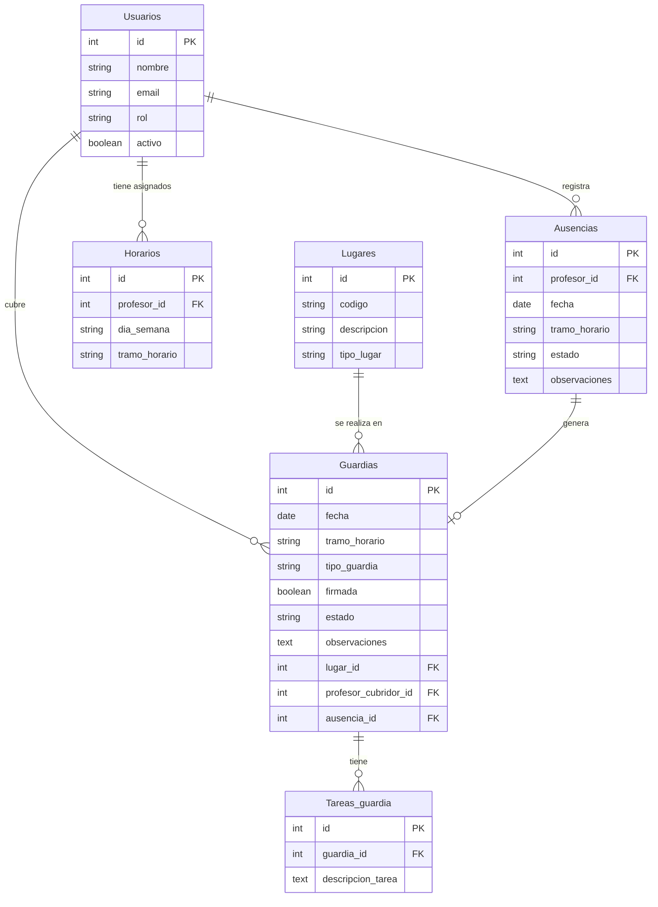

# Diagrama Entidad-Relación - Sistema de Gestión de Guardias

Este documento contiene el diagrama entidad-relación que representa la estructura de la base de datos del Sistema de Gestión de Guardias.

## Diagrama ER

## Descripción de las Entidades

### Usuarios
Representa a los profesores y administradores del sistema.
- **id**: Identificador único del usuario
- **nombre**: Nombre completo del usuario
- **email**: Correo electrónico (usado para autenticación)
- **rol**: Rol del usuario (admin/profesor)
- **activo**: Estado del usuario en el sistema

### Lugares
Representa los espacios físicos donde se realizan las guardias.
- **id**: Identificador único del lugar
- **codigo**: Código único del lugar (ej: "A101")
- **descripcion**: Descripción detallada del lugar
- **tipo_lugar**: Categoría del lugar (aula, patio, etc.)

### Horarios
Representa los tramos horarios en los que un profesor está disponible para realizar guardias.
- **id**: Identificador único del horario
- **profesor_id**: Referencia al profesor
- **dia_semana**: Día de la semana
- **tramo_horario**: Franja horaria específica

### Ausencias
Representa las ausencias registradas por los profesores.
- **id**: Identificador único de la ausencia
- **profesor_id**: Referencia al profesor ausente
- **fecha**: Fecha de la ausencia
- **tramo_horario**: Franja horaria de la ausencia
- **estado**: Estado de la ausencia (Pendiente/Aceptada/Rechazada/Anulada)
- **observaciones**: Notas adicionales sobre la ausencia

### Guardias
Representa las guardias generadas a partir de ausencias o creadas manualmente.
- **id**: Identificador único de la guardia
- **fecha**: Fecha de la guardia
- **tramo_horario**: Franja horaria de la guardia
- **tipo_guardia**: Tipo de guardia (Aula, Patio, Recreo)
- **firmada**: Indica si la guardia ha sido firmada
- **estado**: Estado de la guardia (Pendiente/Asignada/Firmada/Anulada)
- **observaciones**: Notas adicionales sobre la guardia
- **lugar_id**: Referencia al lugar donde se realiza la guardia
- **profesor_cubridor_id**: Referencia al profesor que cubre la guardia (puede ser NULL si está pendiente)
- **ausencia_id**: Referencia a la ausencia que generó la guardia (puede ser NULL si fue creada manualmente)

### Tareas_guardia
Representa las tareas específicas asociadas a una guardia.
- **id**: Identificador único de la tarea
- **guardia_id**: Referencia a la guardia
- **descripcion_tarea**: Descripción detallada de la tarea a realizar durante la guardia

## Relaciones Principales

1. Un **Usuario** puede tener asignados múltiples **Horarios** de guardia.
2. Un **Usuario** puede registrar múltiples **Ausencias**.
3. Un **Usuario** puede cubrir múltiples **Guardias**.
4. Un **Lugar** puede ser el sitio donde se realizan múltiples **Guardias**.
5. Una **Ausencia** puede generar una **Guardia** específica (relación 1:1 o 1:0).
6. Una **Guardia** puede tener múltiples **Tareas_guardia** asociadas.

## Notas sobre el Ciclo de Vida y Relaciones

### Relación entre Ausencias y Guardias

- La relación entre **Ausencias** y **Guardias** es de uno a uno (una ausencia genera exactamente una guardia) o de uno a cero (ausencia pendiente o rechazada).
- El campo `ausencia_id` en **Guardias** es opcional, permitiendo:
  - Guardias vinculadas a ausencias específicas (cuando `ausencia_id` no es NULL)
  - Guardias creadas manualmente sin asociación a ausencias (cuando `ausencia_id` es NULL)

### Estados y Transiciones

- **Ausencias**:
  - **PENDIENTE**: Ausencia registrada, esperando aprobación administrativa.
  - **ACEPTADA**: Ausencia aprobada que ha generado una guardia.
  - **RECHAZADA**: Ausencia denegada sin generación de guardia.
  - **ANULADA**: Ausencia cancelada por el profesor o administrador.

- **Guardias**:
  - **PENDIENTE**: Guardia creada pero sin profesor asignado.
  - **ASIGNADA**: Guardia con profesor asignado pero aún no realizada/firmada.
  - **FIRMADA**: Guardia realizada y firmada por el profesor (estado terminal).
  - **ANULADA**: Guardia cancelada.

### Reglas de Integridad

1. Cuando una ausencia se acepta, genera automáticamente una guardia en estado PENDIENTE.
2. Si una guardia vinculada a una ausencia se anula, la ausencia vuelve a estado PENDIENTE.
3. Si una ausencia se anula y tiene una guardia asociada no firmada, la guardia también se anula.
4. Las guardias en estado FIRMADA no pueden modificarse ni anularse.
5. Solo las guardias en estado ANULADA pueden eliminarse permanentemente. 