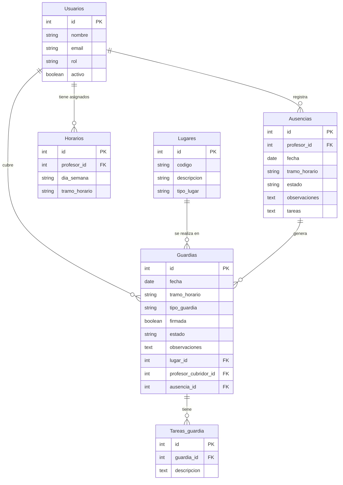

# Diagrama Entidad-Relación - Sistema de Gestión de Guardias

Este documento contiene el diagrama entidad-relación que representa la estructura de la base de datos del Sistema de Gestión de Guardias.

## Diagrama ER

## Descripción de las Entidades

### Usuarios
Representa a los profesores y administradores del sistema.
- **id**: Identificador único del usuario
- **nombre**: Nombre completo del usuario
- **email**: Correo electrónico (usado para autenticación)
- **rol**: Rol del usuario (admin/profesor)
- **activo**: Estado del usuario en el sistema

### Lugares
Representa los espacios físicos donde se realizan las guardias.
- **id**: Identificador único del lugar
- **codigo**: Código único del lugar (ej: "A101")
- **descripcion**: Descripción detallada del lugar
- **tipo_lugar**: Categoría del lugar (aula, patio, etc.)

### Horarios
Representa los tramos horarios en los que un profesor está disponible para realizar guardias.
- **id**: Identificador único del horario
- **profesor_id**: Referencia al profesor
- **dia_semana**: Día de la semana
- **tramo_horario**: Franja horaria específica

### Ausencias
Representa las ausencias registradas por los profesores.
- **id**: Identificador único de la ausencia
- **profesor_id**: Referencia al profesor ausente
- **fecha**: Fecha de la ausencia
- **tramo_horario**: Franja horaria de la ausencia
- **estado**: Estado de la ausencia (Pendiente/Aceptada/Rechazada)
- **observaciones**: Notas adicionales sobre la ausencia
- **tareas**: Tareas asignadas para los alumnos durante la ausencia

### Guardias
Representa las guardias generadas a partir de ausencias.
- **id**: Identificador único de la guardia
- **fecha**: Fecha de la guardia
- **tramo_horario**: Franja horaria de la guardia
- **tipo_guardia**: Tipo de guardia
- **firmada**: Indica si la guardia ha sido firmada
- **estado**: Estado de la guardia (Pendiente/Asignada/Firmada/Anulada)
- **observaciones**: Notas adicionales sobre la guardia
- **lugar_id**: Referencia al lugar donde se realiza la guardia
- **profesor_cubridor_id**: Referencia al profesor que cubre la guardia
- **ausencia_id**: Referencia a la ausencia que generó la guardia

### Tareas_guardia
Representa las tareas específicas asociadas a una guardia.
- **id**: Identificador único de la tarea
- **guardia_id**: Referencia a la guardia
- **descripcion**: Descripción detallada de la tarea

## Relaciones Principales

1. Un **Usuario** puede tener asignados múltiples **Horarios** de guardia.
2. Un **Usuario** puede registrar múltiples **Ausencias**.
3. Un **Usuario** puede cubrir múltiples **Guardias**.
4. Un **Lugar** puede ser el sitio donde se realizan múltiples **Guardias**.
5. Una **Ausencia** puede generar múltiples **Guardias** (en diferentes tramos horarios).
6. Una **Guardia** puede tener múltiples **Tareas_guardia** asociadas.

## Notas Adicionales

- La tabla **Usuarios** almacena tanto a profesores como administradores, diferenciados por el campo `rol`.
- El campo `estado` en **Ausencias** permite seguir el flujo de aprobación (Pendiente → Aceptada/Rechazada).
- El campo `estado` en **Guardias** permite seguir el flujo de asignación y firma (Pendiente → Asignada → Firmada).
- La relación entre **Ausencias** y **Guardias** permite rastrear qué guardias fueron generadas por cada ausencia.
- El campo `ausencia_id` en **Guardias** puede ser nulo en caso de guardias que no están asociadas a ausencias específicas. 