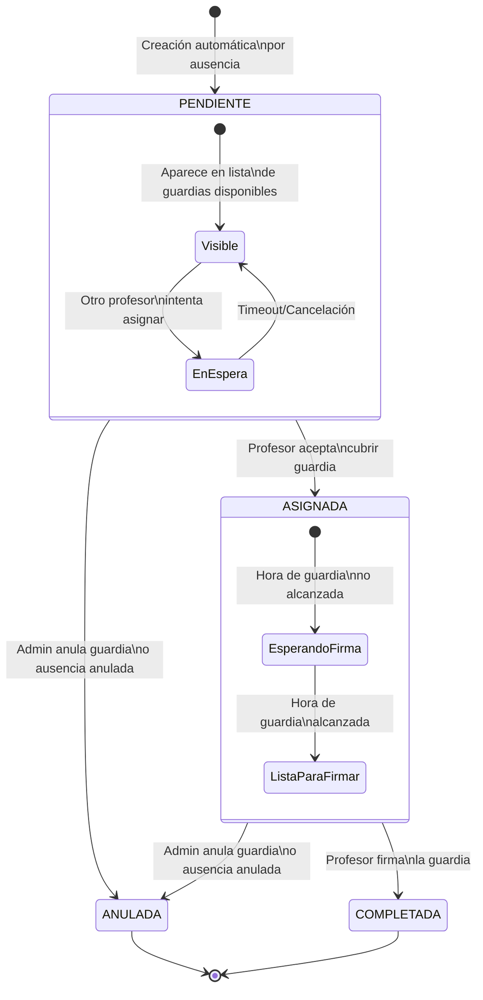
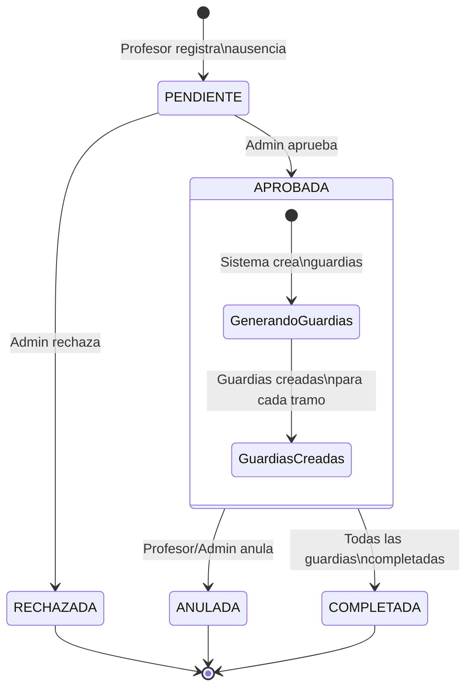
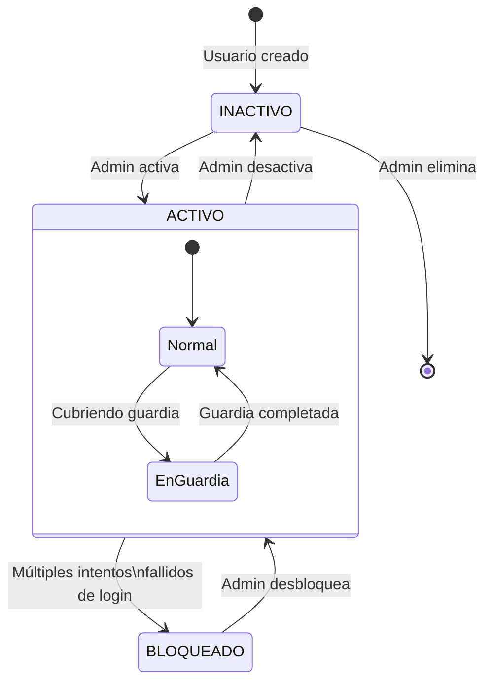

# Diagramas de Estados del Sistema

Este documento describe los diferentes estados y transiciones posibles para los elementos principales del sistema.

## Índice
1. [Estados de Guardias](#estados-de-guardias)
2. [Estados de Ausencias](#estados-de-ausencias)
3. [Estados de Usuarios](#estados-de-usuarios)

## Estados de Guardias

## Estados de Ausencias

## Estados de Usuarios

## Notas sobre los Estados

### Guardias
- **PENDIENTE**: La guardia está disponible para ser cubierta por cualquier profesor.
- **ASIGNADA**: Un profesor se ha comprometido a cubrir la guardia.
- **COMPLETADA**: La guardia ha sido realizada y firmada.
- **ANULADA**: La guardia ha sido cancelada (por anulación de ausencia o decisión administrativa).

### Ausencias
- **PENDIENTE**: Esperando aprobación administrativa.
- **APROBADA**: Ausencia autorizada, genera guardias automáticamente.
- **RECHAZADA**: Ausencia no autorizada.
- **ANULADA**: Ausencia cancelada (elimina o anula guardias asociadas).
- **COMPLETADA**: Todas las guardias asociadas han sido realizadas.

### Usuarios
- **INACTIVO**: Usuario creado pero no puede acceder al sistema.
- **ACTIVO**: Usuario puede acceder y utilizar el sistema.
- **BLOQUEADO**: Usuario temporalmente bloqueado por seguridad. 