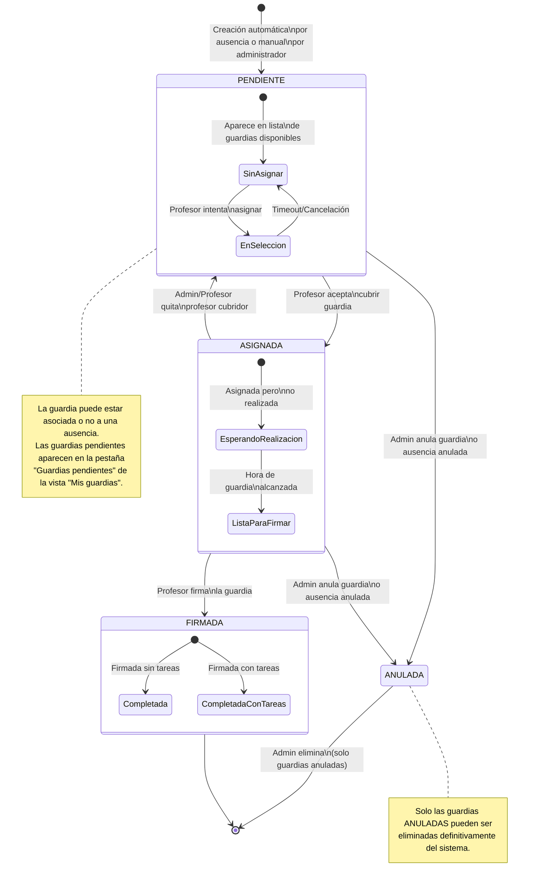
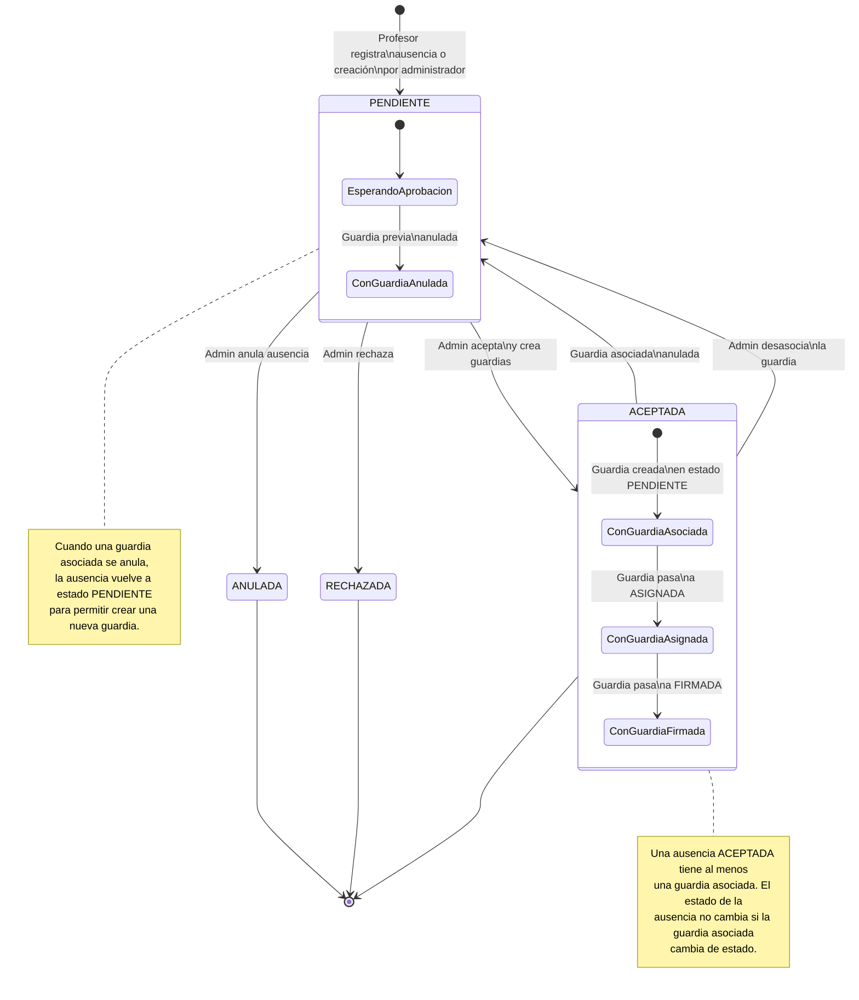
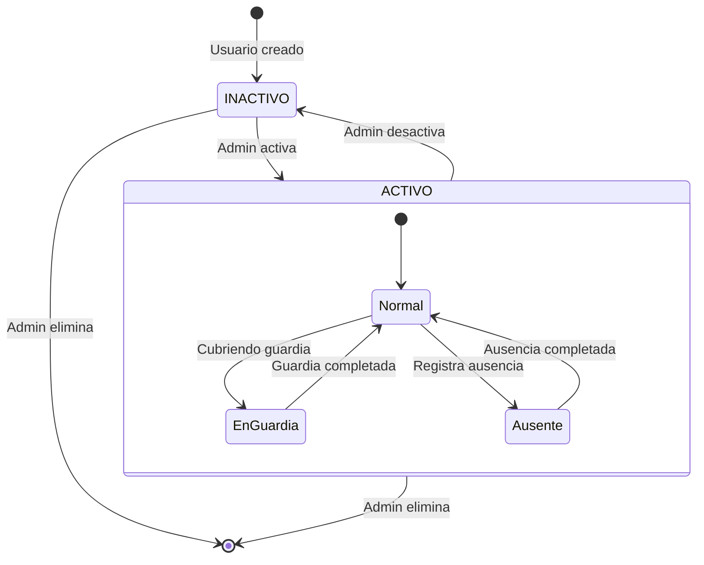
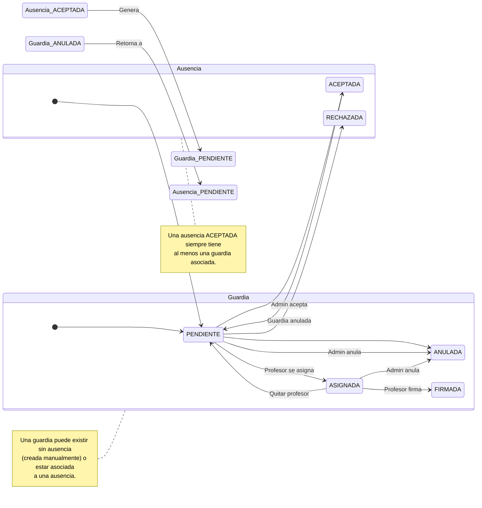

# Diagramas de Estados del Sistema

Este documento describe los diferentes estados y transiciones posibles para los elementos principales del sistema.

## Índice
1. [Estados de Guardias](#estados-de-guardias)
2. [Estados de Ausencias](#estados-de-ausencias)
3. [Estados de Usuarios](#estados-de-usuarios)

## Estados de Guardias

## Estados de Ausencias

## Estados de Usuarios

## Notas sobre los Estados

### Guardias
- **PENDIENTE**: La guardia está disponible para ser cubierta por cualquier profesor que tenga horario para ese día y tramo y no esté cubriendo otra guardia en ese momento.
- **ASIGNADA**: Un profesor se ha comprometido a cubrir la guardia pero aún no la ha realizado o no la ha firmado.
- **FIRMADA**: La guardia ha sido realizada y firmada. Puede incluir tareas realizadas durante la guardia.
- **ANULADA**: La guardia ha sido cancelada (por anulación de ausencia o decisión administrativa).

### Ausencias
- **PENDIENTE**: Esperando aprobación administrativa o requiere nueva asignación tras anulación.
- **ACEPTADA**: Ausencia autorizada que tiene al menos una guardia asociada.
- **RECHAZADA**: Ausencia no autorizada.
- **ANULADA**: Ausencia cancelada por el administrador.

### Usuarios
- **INACTIVO**: Usuario creado pero no puede acceder al sistema.
- **ACTIVO**: Usuario puede acceder y utilizar el sistema.

## Relación entre Ausencias y Guardias

