# Diagramas de Flujo - Sistema de Gestión de Guardias

Este documento contiene los diagramas de flujo de las principales funcionalidades del Sistema de Gestión de Guardias, representados en formato Mermaid.

## Índice
- [Diagramas de Flujo - Sistema de Gestión de Guardias](#diagramas-de-flujo---sistema-de-gestión-de-guardias)
  - [Índice](#índice)
  - [Flujo General del Sistema](#flujo-general-del-sistema)
  - [Flujos para Profesores](#flujos-para-profesores)
    - [Registro de Ausencia](#registro-de-ausencia)
    - [Visualización de Horario](#visualización-de-horario)
    - [Gestión de Mis Guardias](#gestión-de-mis-guardias)
    - [Asignación a Guardia Pendiente](#asignación-a-guardia-pendiente)
    - [Firma de Guardia](#firma-de-guardia)
  - [Flujos para Administradores](#flujos-para-administradores)
    - [Gestión de Usuarios](#gestión-de-usuarios)
    - [Gestión de Horarios](#gestión-de-horarios)
    - [Gestión de Lugares](#gestión-de-lugares)
    - [Gestión de Guardias](#gestión-de-guardias)
    - [Gestión de Ausencias](#gestión-de-ausencias)
  - [Flujos de Procesos Automáticos](#flujos-de-procesos-automáticos)
    - [Creación de Guardia desde Ausencia](#creación-de-guardia-desde-ausencia)
    - [Anulación de Guardia](#anulación-de-guardia)
  - [Flujos de Integración entre Entidades](#flujos-de-integración-entre-entidades)
    - [Relación entre Ausencias y Guardias](#relación-entre-ausencias-y-guardias)
    - [Proceso Completo de Gestión de Ausencias y Guardias](#proceso-completo-de-gestión-de-ausencias-y-guardias)
    - [Proceso de Creación de Guardias](#proceso-de-creación-de-guardias)
    - [Proceso de Firma de Guardias con Tareas](#proceso-de-firma-de-guardias-con-tareas)
    - [Proceso de Anulación de Guardias](#proceso-de-anulación-de-guardias)
  - [Ciclos de Vida](#ciclos-de-vida)
    - [Ciclo de Vida de una Ausencia](#ciclo-de-vida-de-una-ausencia)
    - [Ciclo de Vida de una Guardia](#ciclo-de-vida-de-una-guardia)

## Flujo General del Sistema

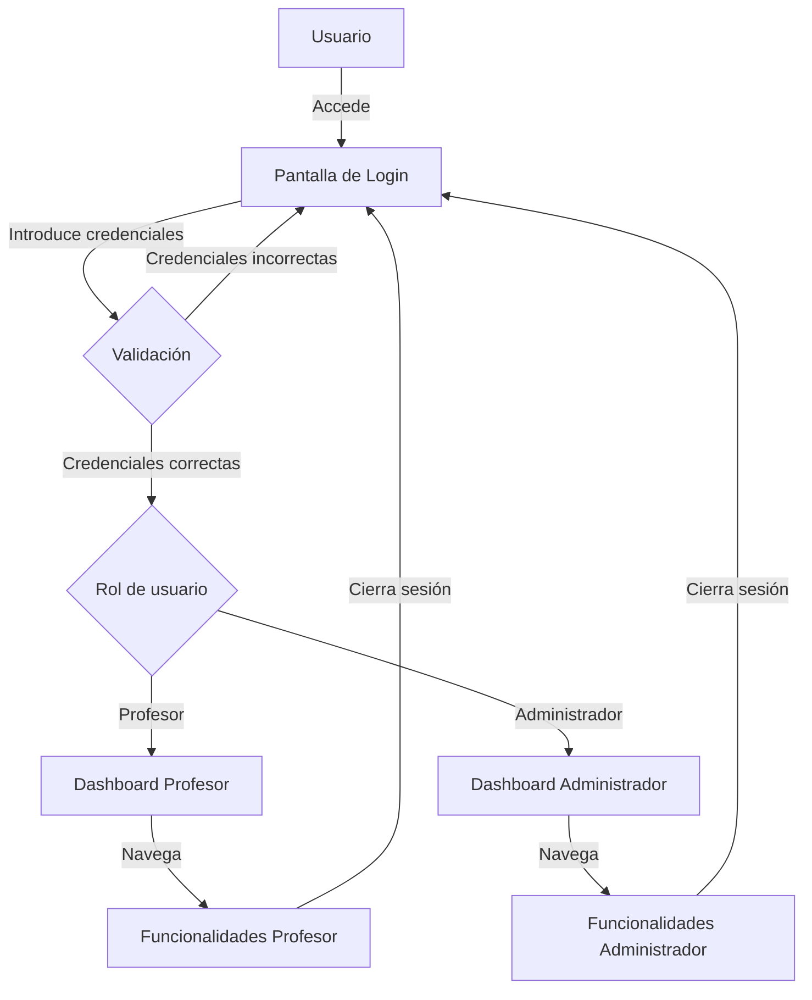
```mermaid
flowchart TD
    A[Usuario] -->|Accede| B[Pantalla de Login]
    B -->|Introduce credenciales| C{Validación}
    C -->|Credenciales correctas| D{Rol de usuario}
    C -->|Credenciales incorrectas| B
    D -->|Profesor| E[Dashboard Profesor]
    D -->|Administrador| F[Dashboard Administrador]
    E -->|Navega| G[Funcionalidades Profesor]
    F -->|Navega| H[Funcionalidades Administrador]
    G -->|Cierra sesión| B
    H -->|Cierra sesión| B
```

## Flujos para Profesores

### Registro de Ausencia

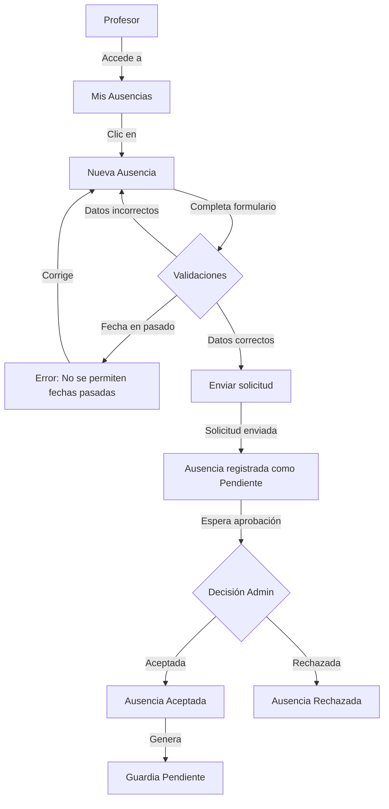
```mermaid
flowchart TD
    A[Profesor] -->|Accede a| B[Mis Ausencias]
    B -->|Clic en| C[Nueva Ausencia]
    C -->|Completa formulario| D{Validaciones}
    D -->|Fecha en pasado| E[Error: No se permiten fechas pasadas]
    E -->|Corrige| C
    D -->|Datos incorrectos| C
    D -->|Datos correctos| F[Enviar solicitud]
    F -->|Solicitud enviada| G[Ausencia registrada como Pendiente]
    G -->|Espera aprobación| H{Decisión Admin}
    H -->|Aceptada| I[Ausencia Aceptada]
    H -->|Rechazada| J[Ausencia Rechazada]
    I -->|Genera| K[Guardia Pendiente]
```

### Visualización de Horario

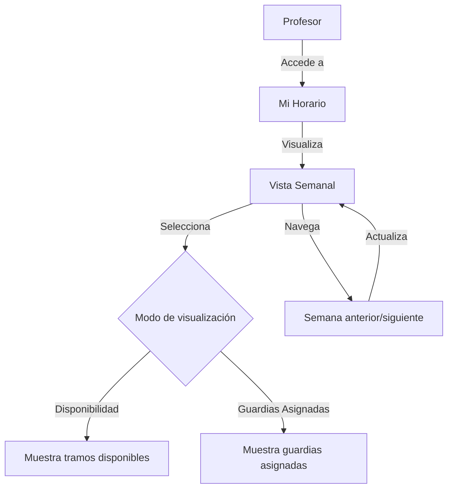
```mermaid
flowchart TD
    A[Profesor] -->|Accede a| B[Mi Horario]
    B -->|Visualiza| C[Vista Semanal]
    C -->|Selecciona| D{Modo de visualización}
    D -->|Disponibilidad| E[Muestra tramos disponibles]
    D -->|Guardias Asignadas| F[Muestra guardias asignadas]
    C -->|Navega| G[Semana anterior/siguiente]
    G -->|Actualiza| C
```

### Gestión de Mis Guardias

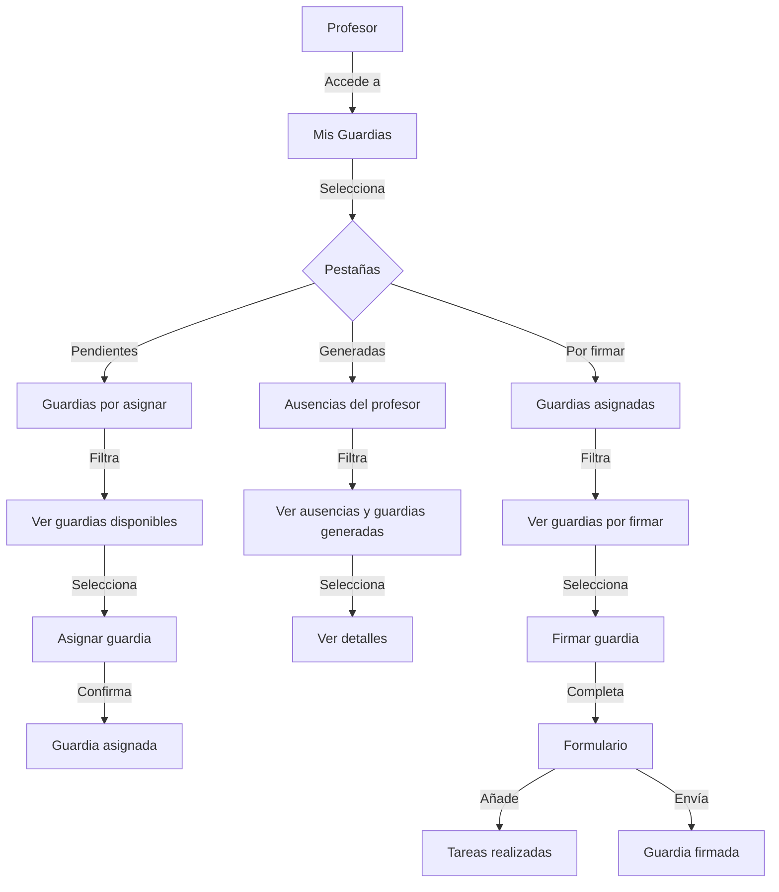
```mermaid
flowchart TD
    A[Profesor] -->|Accede a| B[Mis Guardias]
    B -->|Selecciona| C{Pestañas}
    
    C -->|Pendientes| D[Guardias por asignar]
    D -->|Filtra| D1[Ver guardias disponibles]
    D1 -->|Selecciona| D2[Asignar guardia]
    
    C -->|Generadas| E[Ausencias del profesor]
    E -->|Filtra| E1[Ver ausencias y guardias generadas]
    E1 -->|Selecciona| E2[Ver detalles]
    
    C -->|Por firmar| F[Guardias asignadas]
    F -->|Filtra| F1[Ver guardias por firmar]
    F1 -->|Selecciona| F2[Firmar guardia]
    
    D2 -->|Confirma| G[Guardia asignada]
    F2 -->|Completa| H[Formulario]
    H -->|Añade| H1[Tareas realizadas]
    H -->|Envía| I[Guardia firmada]
```

### Asignación a Guardia Pendiente

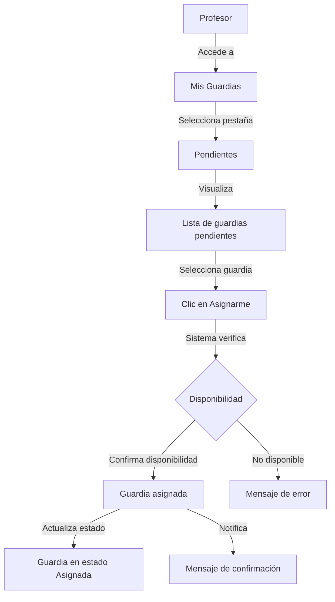
```mermaid
flowchart TD
    A[Profesor] -->|Accede a| B[Mis Guardias]
    B -->|Selecciona pestaña| C[Pendientes]
    C -->|Visualiza| D[Lista de guardias pendientes]
    D -->|Selecciona guardia| E[Clic en Asignarme]
    E -->|Sistema verifica| F{Disponibilidad}
    F -->|Confirma disponibilidad| G[Guardia asignada]
    F -->|No disponible| H[Mensaje de error]
    G -->|Actualiza estado| I[Guardia en estado Asignada]
    G -->|Notifica| J[Mensaje de confirmación]
```

### Firma de Guardia

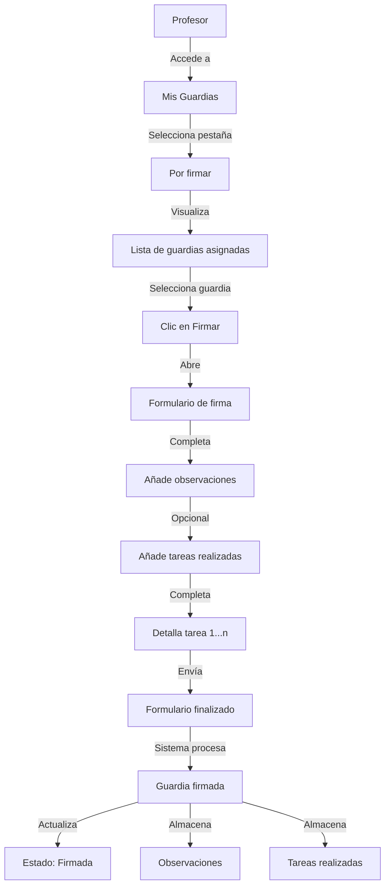
```mermaid
flowchart TD
    A[Profesor] -->|Accede a| B[Mis Guardias]
    B -->|Selecciona pestaña| C[Por firmar]
    C -->|Visualiza| D[Lista de guardias asignadas]
    D -->|Selecciona guardia| E[Clic en Firmar]
    E -->|Abre| F[Formulario de firma]
    F -->|Completa| G[Añade observaciones]
    G -->|Opcional| H[Añade tareas realizadas]
    H -->|Completa| I[Detalla tarea 1...n]
    I -->|Envía| J[Formulario finalizado]
    J -->|Sistema procesa| K[Guardia firmada]
    K -->|Actualiza| L[Estado: Firmada]
    K -->|Almacena| M[Observaciones]
    K -->|Almacena| N[Tareas realizadas]
```

## Flujos para Administradores

### Gestión de Usuarios

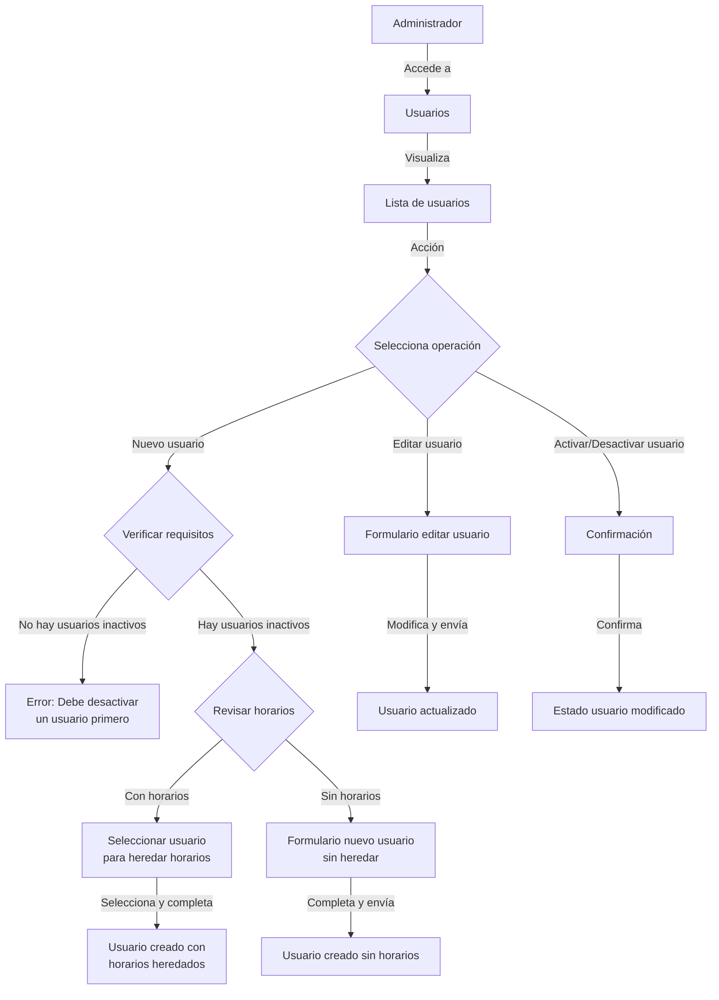
```mermaid
flowchart TD
    A[Administrador] -->|Accede a| B[Usuarios]
    B -->|Visualiza| C[Lista de usuarios]
    C -->|Acción| D{Selecciona operación}
    D -->|Nuevo usuario| E{Verificar requisitos}
    D -->|Editar usuario| F[Formulario editar usuario]
    D -->|Activar/Desactivar usuario| G[Confirmación]
    
    E -->|No hay usuarios inactivos| E1[Error: Debe desactivar\nun usuario primero]
    E -->|Hay usuarios inactivos| E2{Revisar horarios}
    E2 -->|Con horarios| E3[Seleccionar usuario\npara heredar horarios]
    E2 -->|Sin horarios| E4[Formulario nuevo usuario\nsin heredar]
    
    E3 -->|Selecciona y completa| H1[Usuario creado con\nhorarios heredados]
    E4 -->|Completa y envía| H2[Usuario creado sin horarios]
    F -->|Modifica y envía| I[Usuario actualizado]
    G -->|Confirma| J[Estado usuario modificado]
```

### Gestión de Horarios

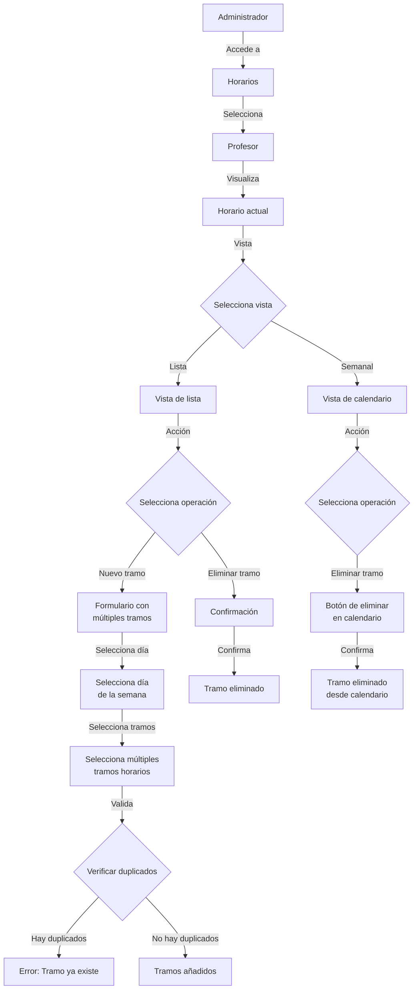
```mermaid
flowchart TD
    A[Administrador] -->|Accede a| B[Horarios]
    B -->|Selecciona| C[Profesor]
    C -->|Visualiza| D[Horario actual]
    D -->|Vista| E{Selecciona vista}
    
    E -->|Lista| E1[Vista de lista]
    E -->|Semanal| E2[Vista de calendario]
    
    E1 -->|Acción| F1{Selecciona operación}
    E2 -->|Acción| F2{Selecciona operación}
    
    F1 -->|Nuevo tramo| G1[Formulario con\nmúltiples tramos]
    F1 -->|Eliminar tramo| G2[Confirmación]
    
    F2 -->|Eliminar tramo| G3[Botón de eliminar\nen calendario]
    
    G1 -->|Selecciona día| G1a[Selecciona día\nde la semana]
    G1a -->|Selecciona tramos| G1b[Selecciona múltiples\ntramos horarios]
    G1b -->|Valida| G1c{Verificar duplicados}
    G1c -->|Hay duplicados| G1d[Error: Tramo ya existe]
    G1c -->|No hay duplicados| G1e[Tramos añadidos]
    
    G2 -->|Confirma| H1[Tramo eliminado]
    G3 -->|Confirma| H2[Tramo eliminado\ndesde calendario]
```

### Visualización de Horario Profesor

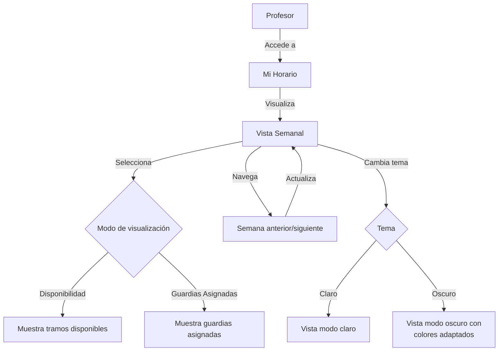
```mermaid
flowchart TD
    A[Profesor] -->|Accede a| B[Mi Horario]
    B -->|Visualiza| C[Vista Semanal]
    C -->|Selecciona| D{Modo de visualización}
    D -->|Disponibilidad| E[Muestra tramos disponibles]
    D -->|Guardias Asignadas| F[Muestra guardias asignadas]
    C -->|Navega| G[Semana anterior/siguiente]
    G -->|Actualiza| C
    C -->|Cambia tema| H{Tema}
    H -->|Claro| I[Vista modo claro]
    H -->|Oscuro| J[Vista modo oscuro con\ncolores adaptados]
```

### Gestión de Lugares

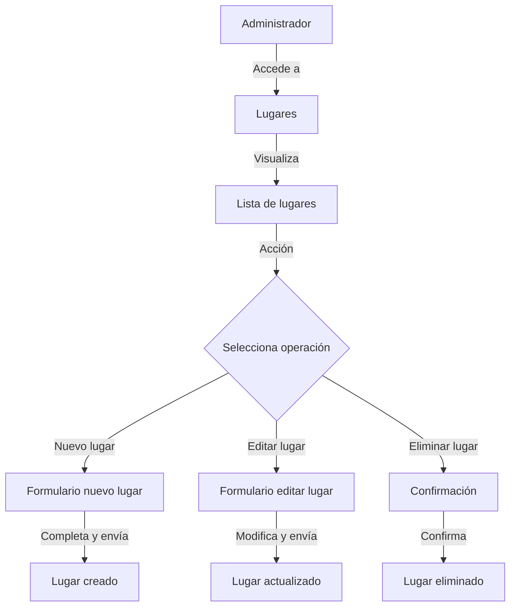
```mermaid
flowchart TD
    A[Administrador] -->|Accede a| B[Lugares]
    B -->|Visualiza| C[Lista de lugares]
    C -->|Acción| D{Selecciona operación}
    D -->|Nuevo lugar| E[Formulario nuevo lugar]
    D -->|Editar lugar| F[Formulario editar lugar]
    D -->|Eliminar lugar| G[Confirmación]
    E -->|Completa y envía| H[Lugar creado]
    F -->|Modifica y envía| I[Lugar actualizado]
    G -->|Confirma| J[Lugar eliminado]
```

### Gestión de Guardias

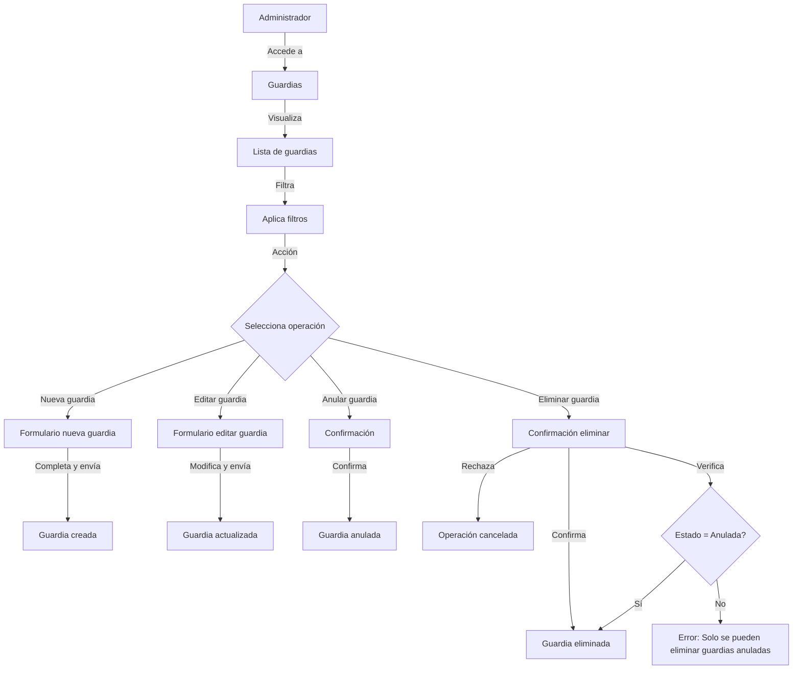
```mermaid
flowchart TD
    A[Administrador] -->|Accede a| B[Guardias]
    B -->|Visualiza| C[Lista de guardias]
    C -->|Filtra| D[Aplica filtros]
    D -->|Acción| E{Selecciona operación}
    E -->|Nueva guardia| F[Formulario nueva guardia]
    E -->|Editar guardia| G[Formulario editar guardia]
    E -->|Anular guardia| H[Confirmación]
    E -->|Eliminar guardia| I[Confirmación eliminar]
    F -->|Completa y envía| J[Guardia creada]
    G -->|Modifica y envía| K[Guardia actualizada]
    H -->|Confirma| L[Guardia anulada]
    I -->|Confirma| M[Guardia eliminada]
    I -->|Rechaza| N[Operación cancelada]
    I -->|Verifica| O{Estado = Anulada?}
    O -->|No| P[Error: Solo se pueden eliminar guardias anuladas]
    O -->|Sí| M
```

### Gestión de Ausencias

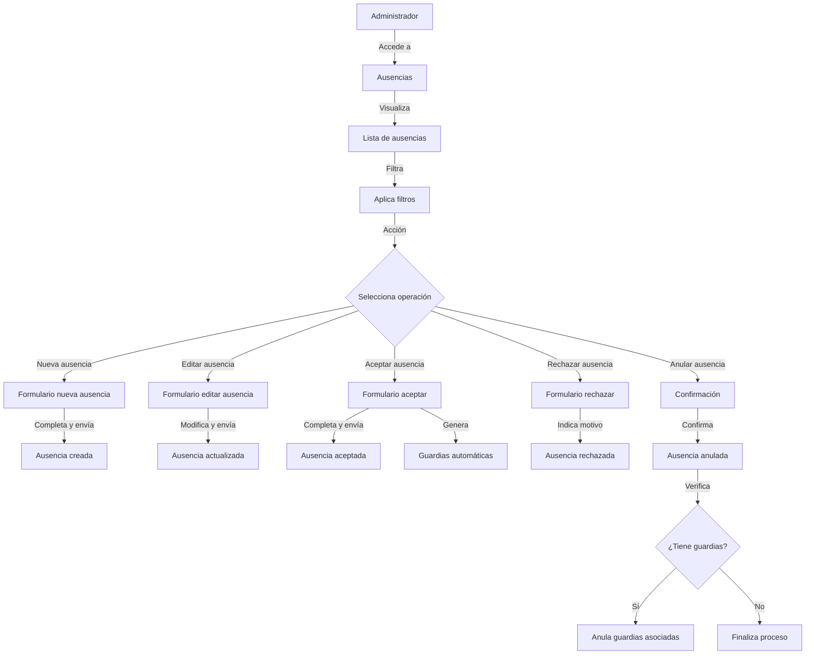
```mermaid
flowchart TD
    A[Administrador] -->|Accede a| B[Ausencias]
    B -->|Visualiza| C[Lista de ausencias]
    C -->|Filtra| D[Aplica filtros]
    D -->|Acción| E{Selecciona operación}
    E -->|Nueva ausencia| F[Formulario nueva ausencia]
    E -->|Editar ausencia| G[Formulario editar ausencia]
    E -->|Aceptar ausencia| H[Formulario aceptar]
    E -->|Rechazar ausencia| I[Formulario rechazar]
    E -->|Anular ausencia| J[Confirmación]
    F -->|Completa y envía| K[Ausencia creada]
    G -->|Modifica y envía| L[Ausencia actualizada]
    H -->|Completa y envía| M[Ausencia aceptada]
    H -->|Genera| N[Guardias automáticas]
    I -->|Indica motivo| O[Ausencia rechazada]
    J -->|Confirma| P[Ausencia anulada]
    P -->|Verifica| Q{¿Tiene guardias?}
    Q -->|Sí| R[Anula guardias asociadas]
    Q -->|No| S[Finaliza proceso]
```

## Flujos de Procesos Automáticos

### Creación de Guardia desde Ausencia

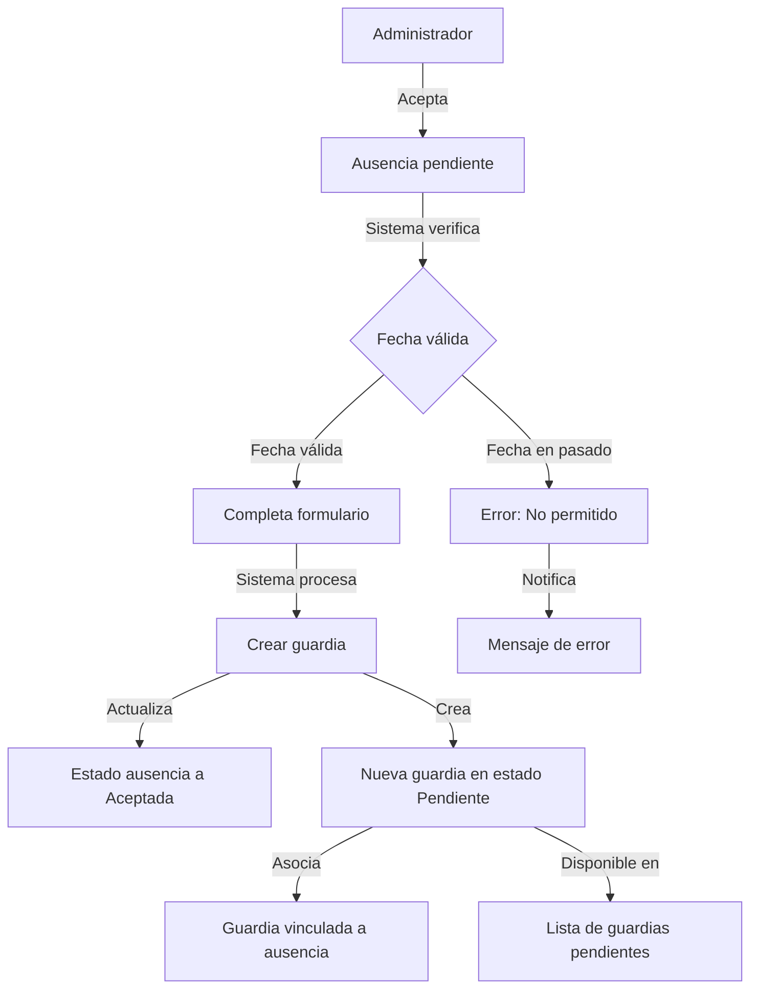
```mermaid
flowchart TD
    A[Administrador] -->|Acepta| B[Ausencia pendiente]
    B -->|Sistema verifica| C{Fecha válida}
    C -->|Fecha en pasado| D[Error: No permitido]
    C -->|Fecha válida| E[Completa formulario]
    E -->|Sistema procesa| F[Crear guardia]
    F -->|Actualiza| G[Estado ausencia a Aceptada]
    F -->|Crea| H[Nueva guardia en estado Pendiente]
    H -->|Asocia| I[Guardia vinculada a ausencia]
    H -->|Disponible en| J[Lista de guardias pendientes]
    D -->|Notifica| K[Mensaje de error]
```

### Anulación de Guardia

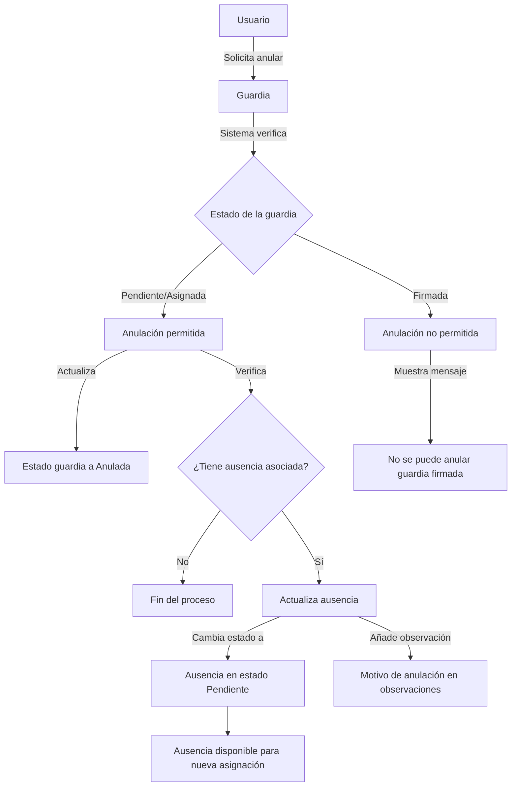
```mermaid
flowchart TD
    A[Usuario] -->|Solicita anular| B[Guardia]
    B -->|Sistema verifica| C{Estado de la guardia}
    C -->|Pendiente/Asignada| D[Anulación permitida]
    C -->|Firmada| E[Anulación no permitida]
    D -->|Actualiza| F[Estado guardia a Anulada]
    D -->|Verifica| G{¿Tiene ausencia asociada?}
    G -->|No| H[Fin del proceso]
    G -->|Sí| I[Actualiza ausencia]
    I -->|Cambia estado a| J[Ausencia en estado Pendiente]
    I -->|Añade observación| K[Motivo de anulación en observaciones]
    J --> L[Ausencia disponible para nueva asignación]
    E -->|Muestra mensaje| M[No se puede anular guardia firmada]
```

## Flujos de Integración entre Entidades

### Relación entre Ausencias y Guardias

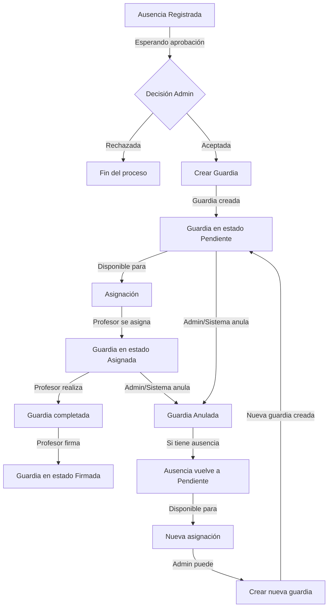
```mermaid
flowchart TD
    A[Ausencia Registrada] -->|Esperando aprobación| B{Decisión Admin}
    B -->|Rechazada| C[Fin del proceso]
    B -->|Aceptada| D[Crear Guardia]
    D -->|Guardia creada| E[Guardia en estado Pendiente]
    E -->|Disponible para| F[Asignación]
    F -->|Profesor se asigna| G[Guardia en estado Asignada]
    G -->|Profesor realiza| H[Guardia completada]
    H -->|Profesor firma| I[Guardia en estado Firmada]
    
    E -->|Admin/Sistema anula| J[Guardia Anulada]
    G -->|Admin/Sistema anula| J
    J -->|Si tiene ausencia| K[Ausencia vuelve a Pendiente]
    K -->|Disponible para| L[Nueva asignación]
    L -->|Admin puede| M[Crear nueva guardia]
    M -->|Nueva guardia creada| E
```

### Proceso Completo de Gestión de Ausencias y Guardias

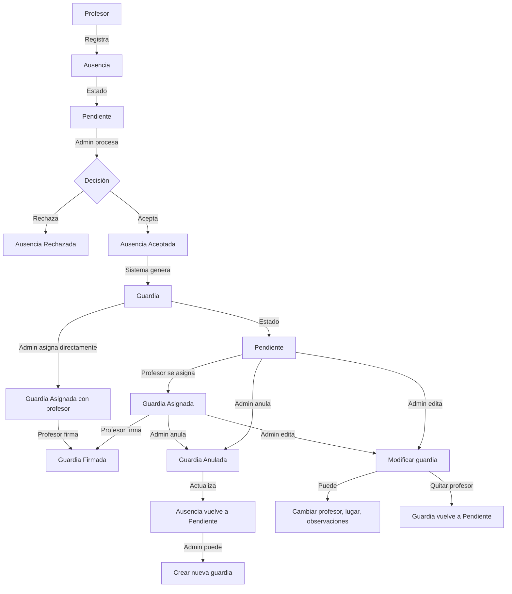
```mermaid
flowchart TD
    A[Profesor] -->|Registra| B[Ausencia]
    B -->|Estado| C[Pendiente]
    C -->|Admin procesa| D{Decisión}
    D -->|Rechaza| E[Ausencia Rechazada]
    D -->|Acepta| F[Ausencia Aceptada]
    F -->|Sistema genera| G[Guardia]
    G -->|Estado| H[Pendiente]
    H -->|Profesor se asigna| I[Guardia Asignada]
    I -->|Profesor firma| J[Guardia Firmada]
    
    H -->|Admin anula| K[Guardia Anulada]
    I -->|Admin anula| K
    K -->|Actualiza| L[Ausencia vuelve a Pendiente]
    L -->|Admin puede| M[Crear nueva guardia]
    
    G -->|Admin asigna directamente| N[Guardia Asignada con profesor]
    N -->|Profesor firma| J
    
    H -->|Admin edita| O[Modificar guardia]
    I -->|Admin edita| O
    O -->|Puede| P[Cambiar profesor, lugar, observaciones]
    O -->|Quitar profesor| Q[Guardia vuelve a Pendiente]
```

### Proceso de Creación de Guardias

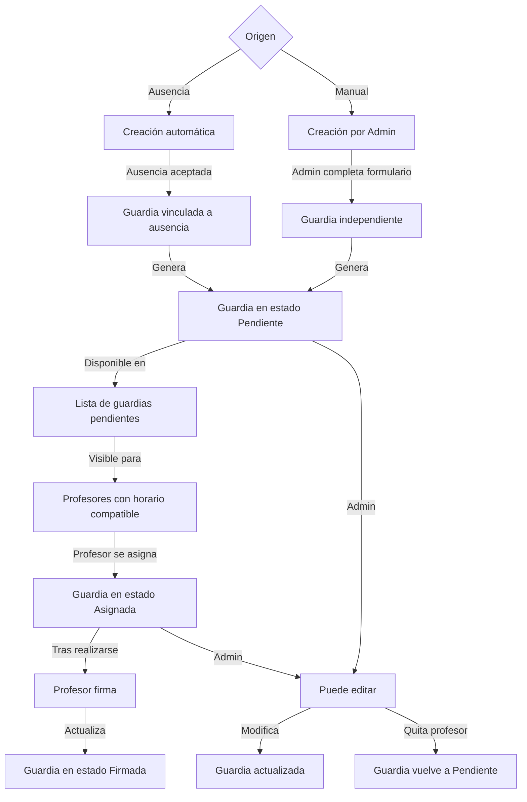
```mermaid
flowchart TD
    A{Origen} -->|Ausencia| B[Creación automática]
    A -->|Manual| C[Creación por Admin]
    
    B -->|Ausencia aceptada| D[Guardia vinculada a ausencia]
    C -->|Admin completa formulario| E[Guardia independiente]
    
    D -->|Genera| F[Guardia en estado Pendiente]
    E -->|Genera| F
    
    F -->|Disponible en| G[Lista de guardias pendientes]
    G -->|Visible para| H[Profesores con horario compatible]
    H -->|Profesor se asigna| I[Guardia en estado Asignada]
    I -->|Tras realizarse| J[Profesor firma]
    J -->|Actualiza| K[Guardia en estado Firmada]
    
    F -->|Admin| L[Puede editar]
    I -->|Admin| L
    L -->|Modifica| M[Guardia actualizada]
    L -->|Quita profesor| N[Guardia vuelve a Pendiente]
```

### Proceso de Firma de Guardias con Tareas

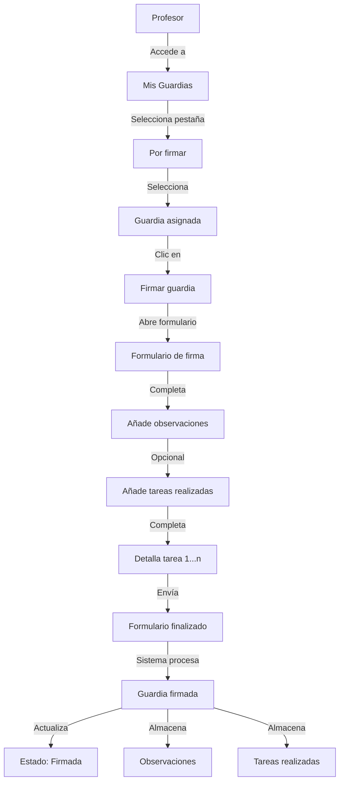
```mermaid
flowchart TD
    A[Profesor] -->|Accede a| B[Mis Guardias]
    B -->|Selecciona pestaña| C[Por firmar]
    C -->|Selecciona| D[Guardia asignada]
    D -->|Clic en| E[Firmar guardia]
    E -->|Abre formulario| F[Formulario de firma]
    F -->|Completa| G[Añade observaciones]
    G -->|Opcional| H[Añade tareas realizadas]
    H -->|Completa| I[Detalla tarea 1...n]
    I -->|Envía| J[Formulario finalizado]
    J -->|Sistema procesa| K[Guardia firmada]
    K -->|Actualiza| L[Estado: Firmada]
    K -->|Almacena| M[Observaciones]
    K -->|Almacena| N[Tareas realizadas]
```

### Proceso de Anulación de Guardias

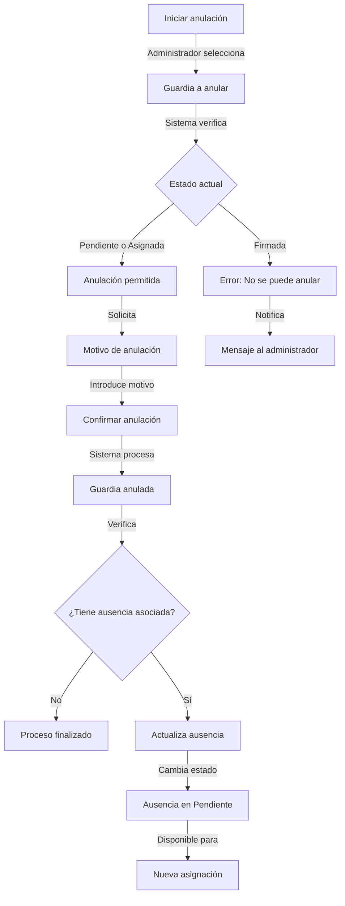
```mermaid
flowchart TD
    A[Iniciar anulación] -->|Administrador selecciona| B[Guardia a anular]
    B -->|Sistema verifica| C{Estado actual}
    C -->|Firmada| D[Error: No se puede anular]
    C -->|Pendiente o Asignada| E[Anulación permitida]
    E -->|Solicita| F[Motivo de anulación]
    F -->|Introduce motivo| G[Confirmar anulación]
    G -->|Sistema procesa| H[Guardia anulada]
    H -->|Verifica| I{¿Tiene ausencia asociada?}
    I -->|No| J[Proceso finalizado]
    I -->|Sí| K[Actualiza ausencia]
    K -->|Cambia estado| L[Ausencia en Pendiente]
    L -->|Disponible para| M[Nueva asignación]
    D -->|Notifica| N[Mensaje al administrador]
```

## Ciclos de Vida

### Ciclo de Vida de una Ausencia

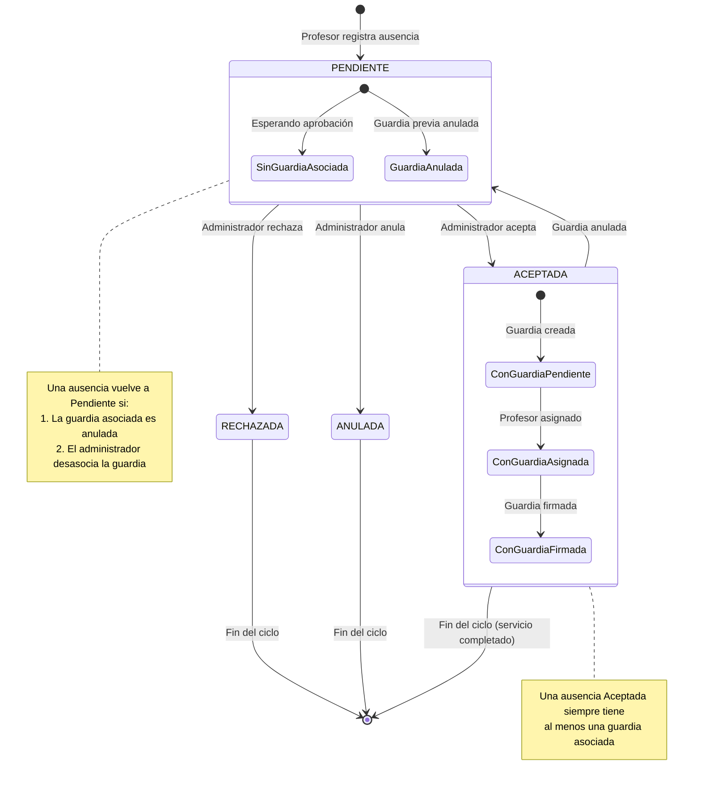
```mermaid
stateDiagram-v2
    [*] --> PENDIENTE: Profesor registra ausencia
    PENDIENTE --> ACEPTADA: Administrador acepta
    PENDIENTE --> RECHAZADA: Administrador rechaza
    ACEPTADA --> PENDIENTE: Guardia anulada
    PENDIENTE --> ANULADA: Administrador anula
    RECHAZADA --> [*]: Fin del ciclo
    ANULADA --> [*]: Fin del ciclo
    ACEPTADA --> [*]: Fin del ciclo (servicio completado)
    
    state PENDIENTE {
        [*] --> SinGuardiaAsociada: Esperando aprobación
        [*] --> GuardiaAnulada: Guardia previa anulada
    }
    
    state ACEPTADA {
        [*] --> ConGuardiaPendiente: Guardia creada
        ConGuardiaPendiente --> ConGuardiaAsignada: Profesor asignado
        ConGuardiaAsignada --> ConGuardiaFirmada: Guardia firmada
    }
    
    note right of PENDIENTE
      Una ausencia vuelve a Pendiente si:
      1. La guardia asociada es anulada
      2. El administrador desasocia la guardia
    end note
    
    note right of ACEPTADA
      Una ausencia Aceptada siempre tiene
      al menos una guardia asociada
    end note
```

### Ciclo de Vida de una Guardia

```mermaid
stateDiagram-v2
    [*] --> PENDIENTE: Creación manual o\npor ausencia
    PENDIENTE --> ASIGNADA: Profesor cubridor\nse asigna o es asignado
    ASIGNADA --> FIRMADA: Profesor cubridor\nfirma la guardia
    PENDIENTE --> ANULADA: Administrador anula
    ASIGNADA --> ANULADA: Administrador anula
    ASIGNADA --> PENDIENTE: Se quita el\nprofesor cubridor
    ANULADA --> [*]: Fin del ciclo\no eliminación
    FIRMADA --> [*]: Fin del ciclo
    
    state PENDIENTE {
        [*] --> Disponible: Visible en sistema
        Disponible --> PorAsignar: Esperando profesor
    }
    
    state ASIGNADA {
        [*] --> Asignada: Con profesor cubridor
        Asignada --> PorFirmar: Esperando firma
    }
    
    state FIRMADA {
        [*] --> FirmadaSinTareas: Sin tareas registradas
        [*] --> FirmadaConTareas: Con tareas registradas
    }
    
    note right of PENDIENTE
      Una guardia puede:
      1. Estar asociada a una ausencia
      2. Ser creada manualmente por administrador
    end note
    
    note right of ANULADA
      Al anular una guardia con ausencia
      asociada, la ausencia vuelve a
      estado Pendiente
    end note
    
    note right of FIRMADA
      Una guardia firmada puede incluir
      tareas realizadas durante la guardia
    end note
``` 