# Diagramas de Flujo - Sistema de Gestión de Guardias

Este documento contiene los diagramas de flujo de las principales funcionalidades del Sistema de Gestión de Guardias, representados en formato Mermaid.

## Índice
- [Diagramas de Flujo - Sistema de Gestión de Guardias](#diagramas-de-flujo---sistema-de-gestión-de-guardias)
  - [Índice](#índice)
  - [Flujo General del Sistema](#flujo-general-del-sistema)
  - [Flujos para Profesores](#flujos-para-profesores)
    - [Registro de Ausencia](#registro-de-ausencia)
    - [Visualización de Horario](#visualización-de-horario)
    - [Asignación a Guardia Pendiente](#asignación-a-guardia-pendiente)
    - [Firma de Guardia](#firma-de-guardia)
  - [Flujos para Administradores](#flujos-para-administradores)
    - [Gestión de Usuarios](#gestión-de-usuarios)
    - [Gestión de Horarios](#gestión-de-horarios)
    - [Gestión de Lugares](#gestión-de-lugares)
    - [Gestión de Guardias](#gestión-de-guardias)
    - [Gestión de Ausencias](#gestión-de-ausencias)
  - [Flujos de Procesos Automáticos](#flujos-de-procesos-automáticos)
    - [Creación de Guardia desde Ausencia](#creación-de-guardia-desde-ausencia)
    - [Anulación de Guardia](#anulación-de-guardia)

## Flujo General del Sistema

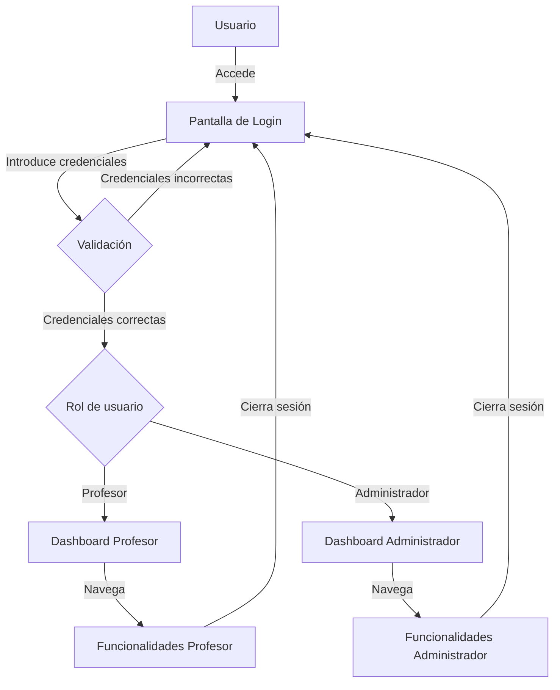

## Flujos para Profesores

### Registro de Ausencia

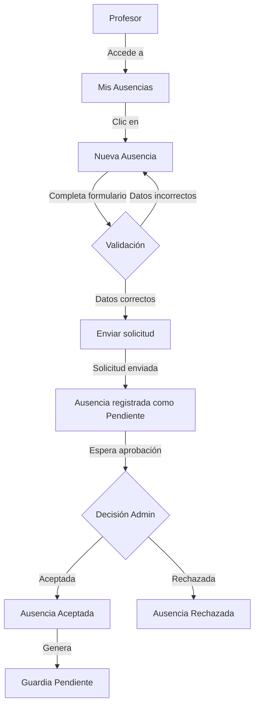

### Visualización de Horario

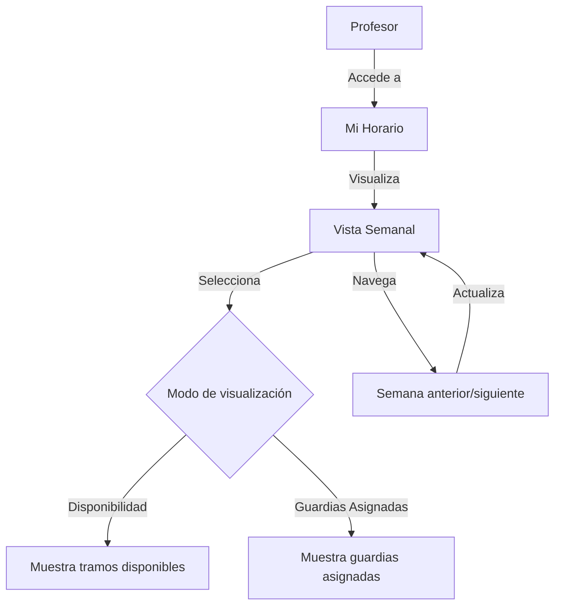

### Asignación a Guardia Pendiente

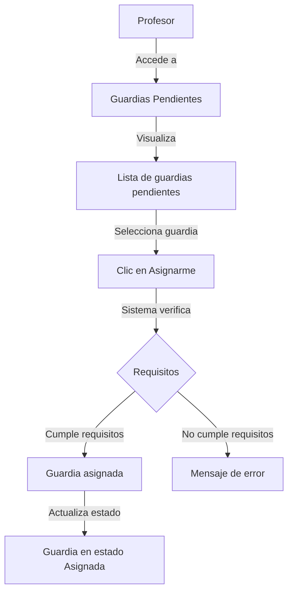

### Firma de Guardia

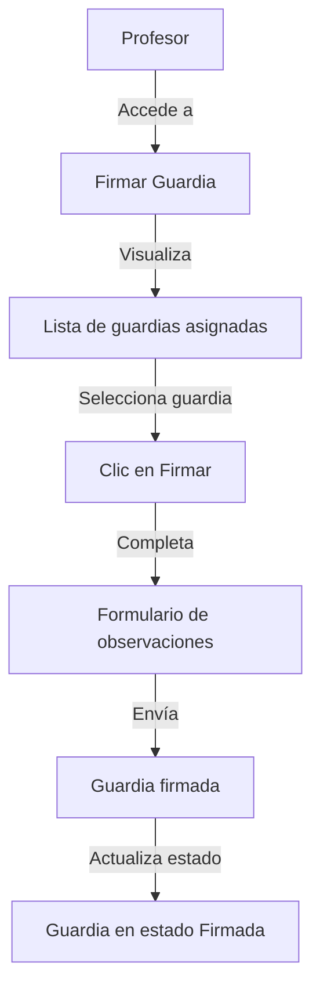

## Flujos para Administradores

### Gestión de Usuarios

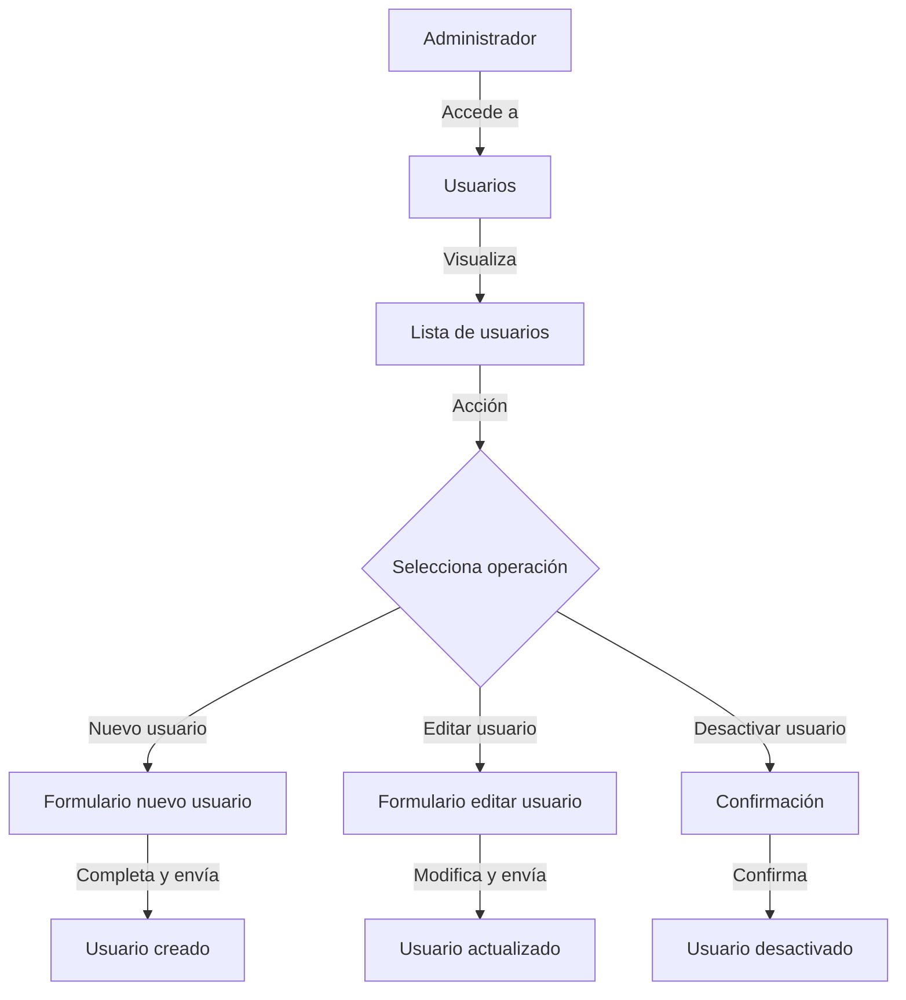

### Gestión de Horarios

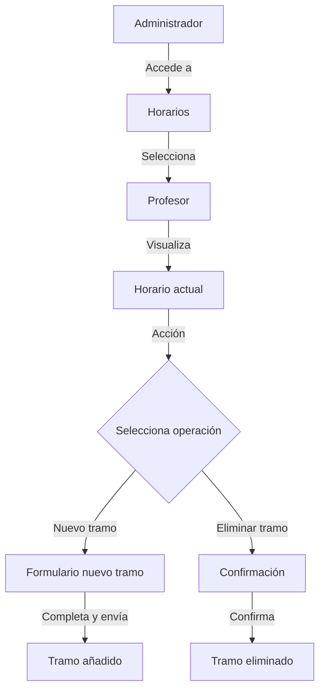

### Gestión de Lugares

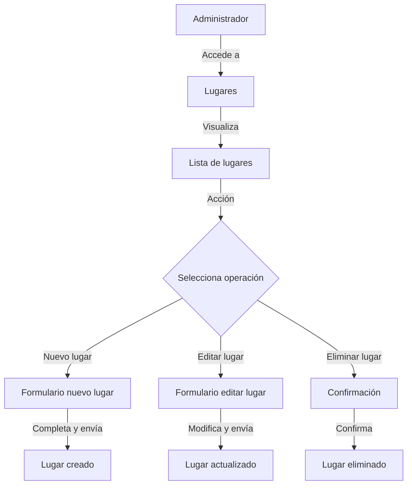

### Gestión de Guardias

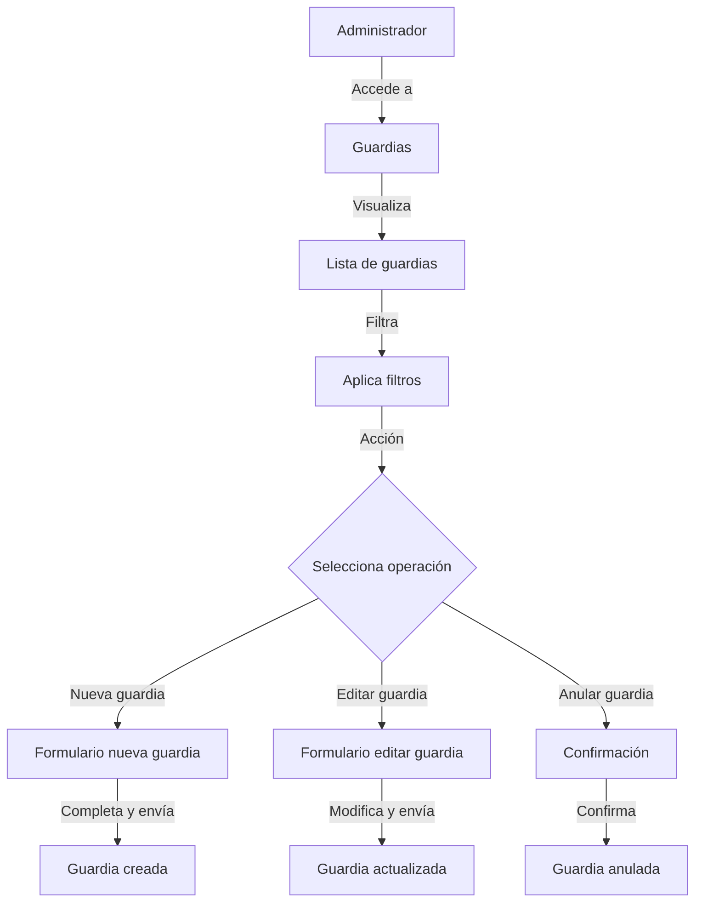

### Gestión de Ausencias

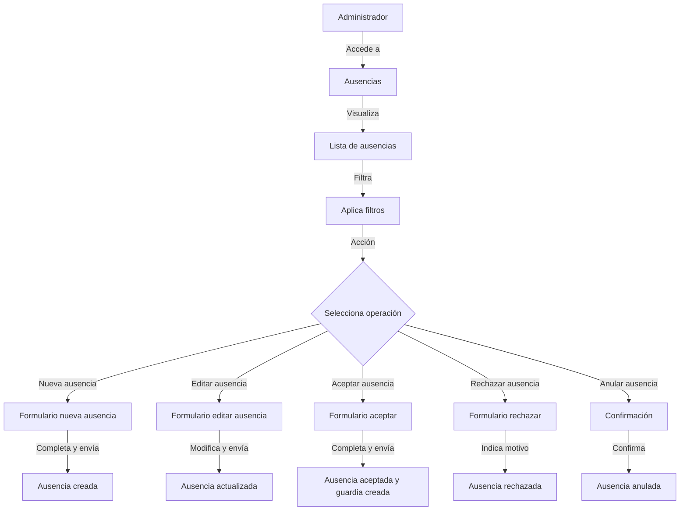

## Flujos de Procesos Automáticos

### Creación de Guardia desde Ausencia

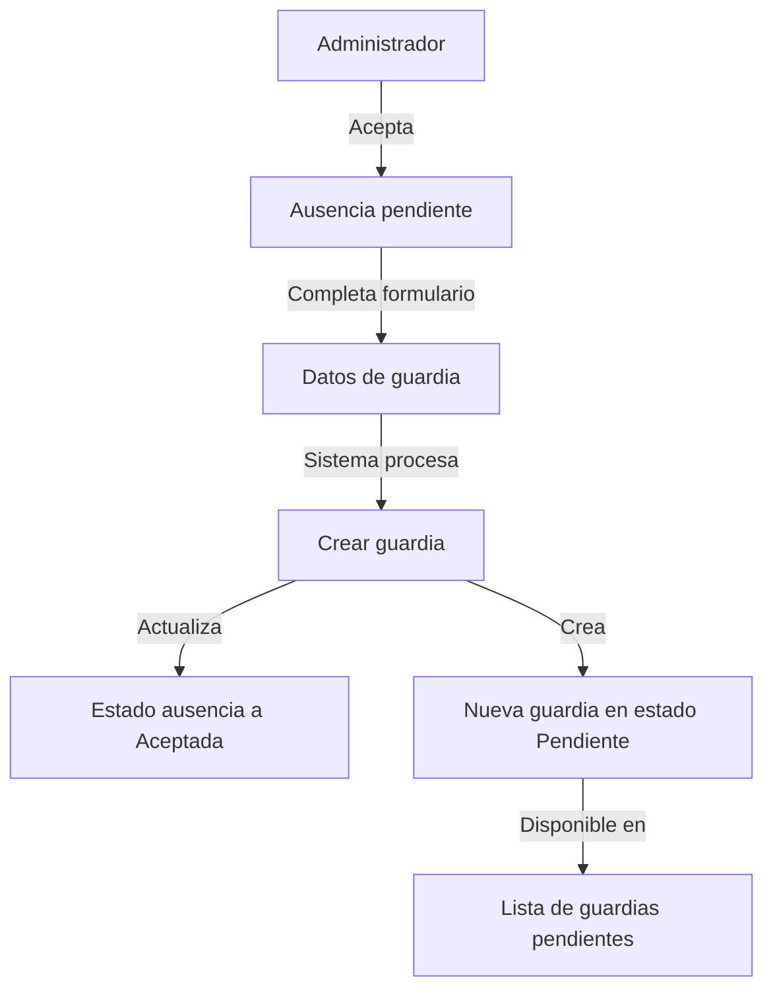

### Anulación de Guardia

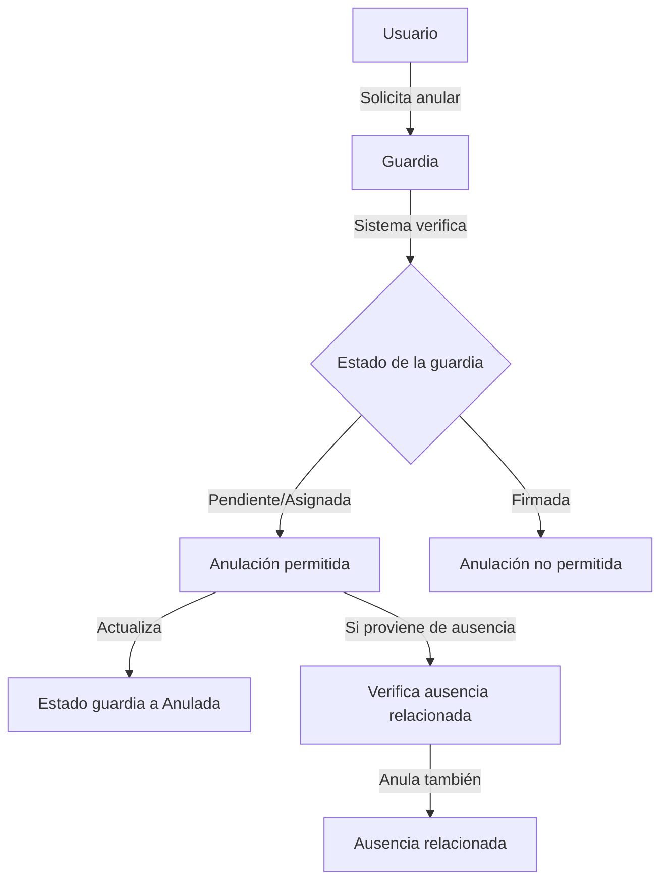