# Diagramas de Flujo - Sistema de Gestión de Guardias

Este documento contiene los diagramas de flujo de las principales funcionalidades del Sistema de Gestión de Guardias, representados en formato Mermaid.

## Índice
- [Diagramas de Flujo - Sistema de Gestión de Guardias](#diagramas-de-flujo---sistema-de-gestión-de-guardias)
  - [Índice](#índice)
  - [Flujo General del Sistema](#flujo-general-del-sistema)
  - [Flujos para Profesores](#flujos-para-profesores)
    - [Registro de Ausencia](#registro-de-ausencia)
    - [Visualización de Horario](#visualización-de-horario)
    - [Asignación a Guardia Pendiente](#asignación-a-guardia-pendiente)
    - [Firma de Guardia](#firma-de-guardia)
  - [Flujos para Administradores](#flujos-para-administradores)
    - [Gestión de Usuarios](#gestión-de-usuarios)
    - [Gestión de Horarios](#gestión-de-horarios)
    - [Gestión de Lugares](#gestión-de-lugares)
    - [Gestión de Guardias](#gestión-de-guardias)
    - [Gestión de Ausencias](#gestión-de-ausencias)
  - [Flujos de Procesos Automáticos](#flujos-de-procesos-automáticos)
    - [Creación de Guardia desde Ausencia](#creación-de-guardia-desde-ausencia)
    - [Anulación de Guardia](#anulación-de-guardia)
  - [Flujos de Integración entre Entidades](#flujos-de-integración-entre-entidades)
    - [Relación entre Ausencias y Guardias](#relación-entre-ausencias-y-guardias)
    - [Proceso Completo de Gestión de Ausencias y Guardias](#proceso-completo-de-gestión-de-ausencias-y-guardias)
    - [Proceso de Creación de Guardias](#proceso-de-creación-de-guardias)
    - [Proceso de Firma de Guardias con Tareas](#proceso-de-firma-de-guardias-con-tareas)
    - [Proceso de Anulación de Guardias](#proceso-de-anulación-de-guardias)
  - [Ciclos de Vida](#ciclos-de-vida)
    - [Ciclo de Vida de una Ausencia](#ciclo-de-vida-de-una-ausencia)
    - [Ciclo de Vida de una Guardia](#ciclo-de-vida-de-una-guardia)

## Flujo General del Sistema

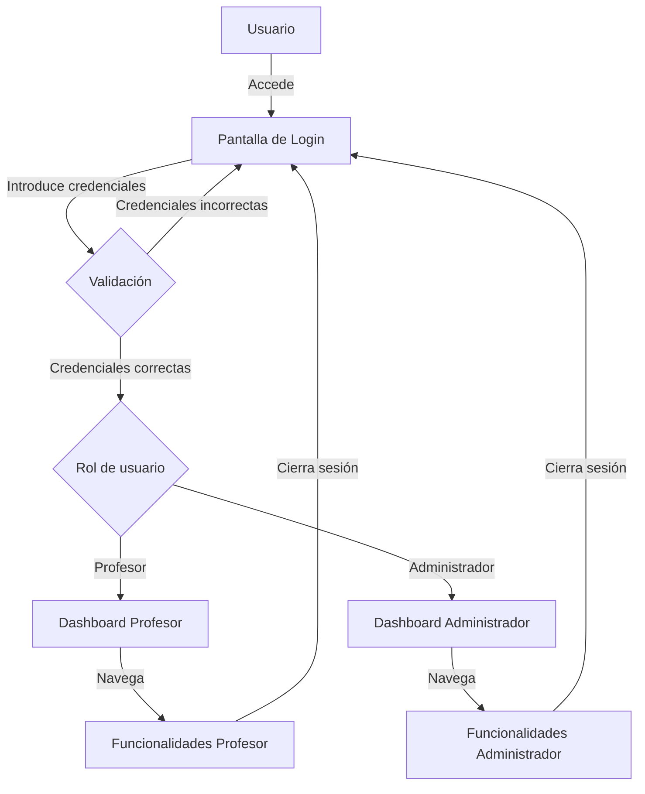
```mermaid
flowchart TD
    A[Usuario] -->|Accede| B[Pantalla de Login]
    B -->|Introduce credenciales| C{Validación}
    C -->|Credenciales correctas| D{Rol de usuario}
    C -->|Credenciales incorrectas| B
    D -->|Profesor| E[Dashboard Profesor]
    D -->|Administrador| F[Dashboard Administrador]
    E -->|Navega| G[Funcionalidades Profesor]
    F -->|Navega| H[Funcionalidades Administrador]
    G -->|Cierra sesión| B
    H -->|Cierra sesión| B
```

## Flujos para Profesores

### Registro de Ausencia

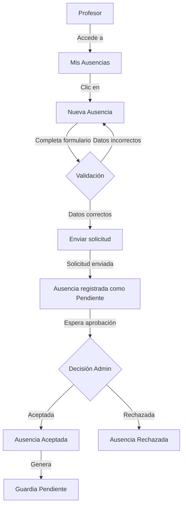
```mermaid
flowchart TD
    A[Profesor] -->|Accede a| B[Mis Ausencias]
    B -->|Clic en| C[Nueva Ausencia]
    C -->|Completa formulario| D{Validación}
    D -->|Datos correctos| E[Enviar solicitud]
    D -->|Datos incorrectos| C
    E -->|Solicitud enviada| F[Ausencia registrada como Pendiente]
    F -->|Espera aprobación| G{Decisión Admin}
    G -->|Aceptada| H[Ausencia Aceptada]
    G -->|Rechazada| I[Ausencia Rechazada]
    H -->|Genera| J[Guardia Pendiente]
```

### Visualización de Horario

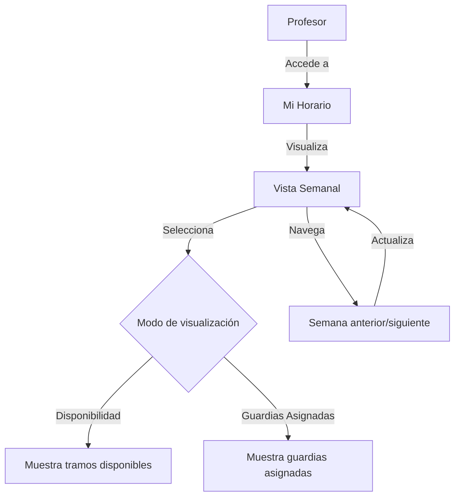
```mermaid
flowchart TD
    A[Profesor] -->|Accede a| B[Mi Horario]
    B -->|Visualiza| C[Vista Semanal]
    C -->|Selecciona| D{Modo de visualización}
    D -->|Disponibilidad| E[Muestra tramos disponibles]
    D -->|Guardias Asignadas| F[Muestra guardias asignadas]
    C -->|Navega| G[Semana anterior/siguiente]
    G -->|Actualiza| C
```

### Asignación a Guardia Pendiente

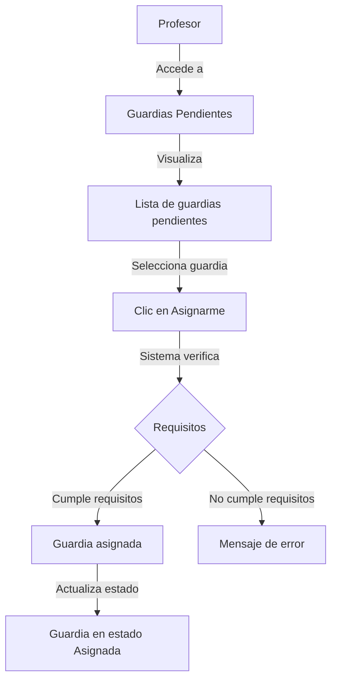
```mermaid
flowchart TD
    A[Profesor] -->|Accede a| B[Guardias Pendientes]
    B -->|Visualiza| C[Lista de guardias pendientes]
    C -->|Selecciona guardia| D[Clic en Asignarme]
    D -->|Sistema verifica| E{Requisitos}
    E -->|Cumple requisitos| F[Guardia asignada]
    E -->|No cumple requisitos| G[Mensaje de error]
    F -->|Actualiza estado| H[Guardia en estado Asignada]
```

### Firma de Guardia

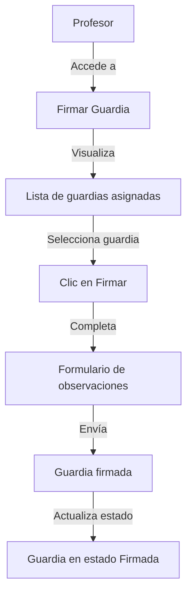
```mermaid
flowchart TD
    A[Profesor] -->|Accede a| B[Firmar Guardia]
    B -->|Visualiza| C[Lista de guardias asignadas]
    C -->|Selecciona guardia| D[Clic en Firmar]
    D -->|Completa| E[Formulario de observaciones]
    E -->|Envía| F[Guardia firmada]
    F -->|Actualiza estado| G[Guardia en estado Firmada]
```

## Flujos para Administradores

### Gestión de Usuarios

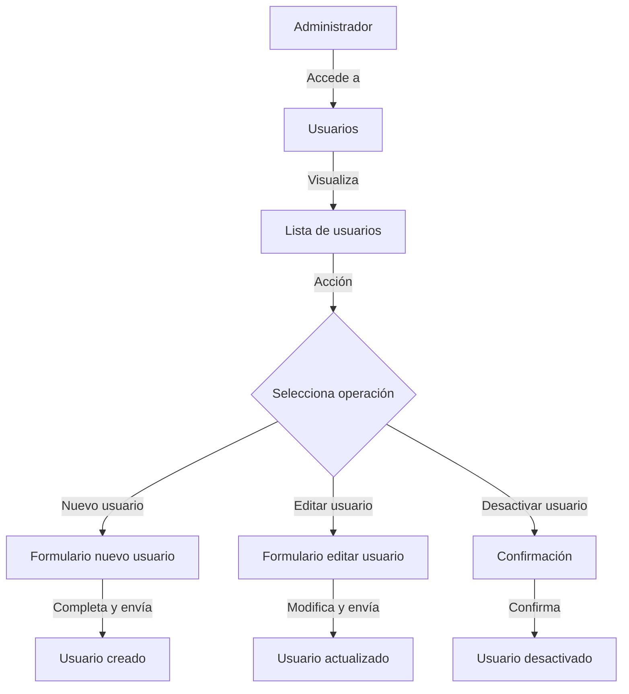
```mermaid
flowchart TD
    A[Administrador] -->|Accede a| B[Usuarios]
    B -->|Visualiza| C[Lista de usuarios]
    C -->|Acción| D{Selecciona operación}
    D -->|Nuevo usuario| E[Formulario nuevo usuario]
    D -->|Editar usuario| F[Formulario editar usuario]
    D -->|Desactivar usuario| G[Confirmación]
    E -->|Completa y envía| H[Usuario creado]
    F -->|Modifica y envía| I[Usuario actualizado]
    G -->|Confirma| J[Usuario desactivado]
```

### Gestión de Horarios

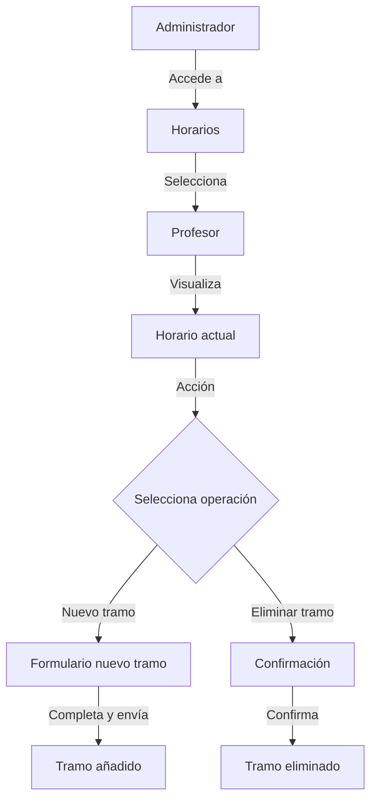
```mermaid
flowchart TD
    A[Administrador] -->|Accede a| B[Horarios]
    B -->|Selecciona| C[Profesor]
    C -->|Visualiza| D[Horario actual]
    D -->|Acción| E{Selecciona operación}
    E -->|Nuevo tramo| F[Formulario nuevo tramo]
    E -->|Eliminar tramo| G[Confirmación]
    F -->|Completa y envía| H[Tramo añadido]
    G -->|Confirma| I[Tramo eliminado]
```

### Gestión de Lugares

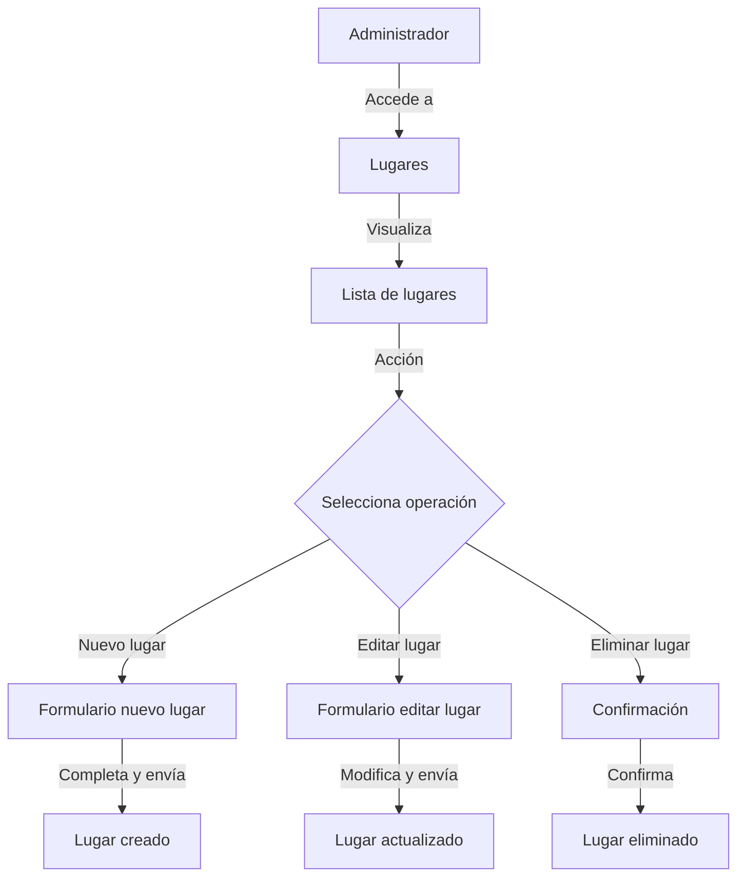
```mermaid
flowchart TD
    A[Administrador] -->|Accede a| B[Lugares]
    B -->|Visualiza| C[Lista de lugares]
    C -->|Acción| D{Selecciona operación}
    D -->|Nuevo lugar| E[Formulario nuevo lugar]
    D -->|Editar lugar| F[Formulario editar lugar]
    D -->|Eliminar lugar| G[Confirmación]
    E -->|Completa y envía| H[Lugar creado]
    F -->|Modifica y envía| I[Lugar actualizado]
    G -->|Confirma| J[Lugar eliminado]
```

### Gestión de Guardias

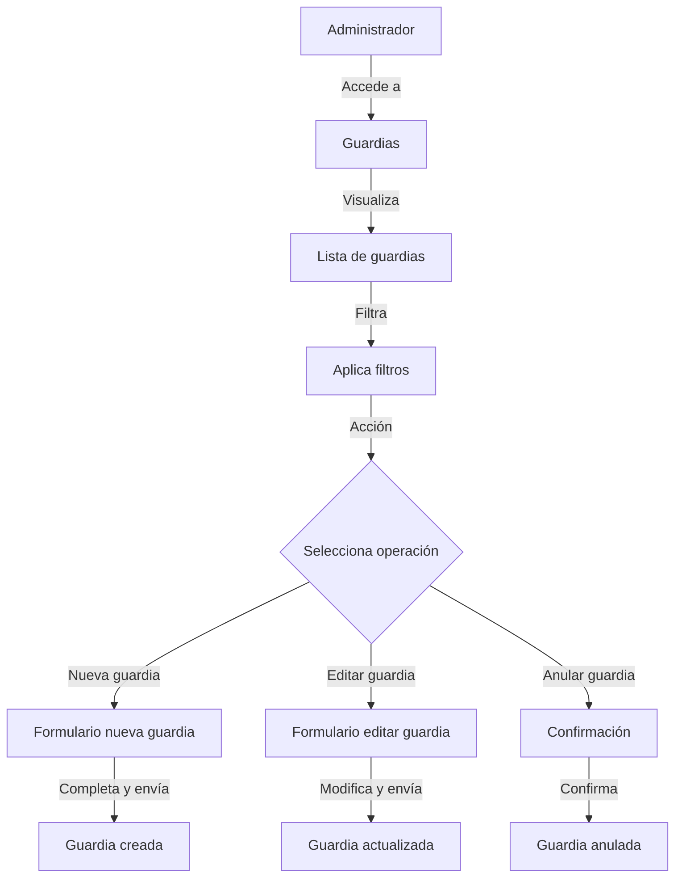
```mermaid
flowchart TD
    A[Administrador] -->|Accede a| B[Guardias]
    B -->|Visualiza| C[Lista de guardias]
    C -->|Filtra| D[Aplica filtros]
    D -->|Acción| E{Selecciona operación}
    E -->|Nueva guardia| F[Formulario nueva guardia]
    E -->|Editar guardia| G[Formulario editar guardia]
    E -->|Anular guardia| H[Confirmación]
    F -->|Completa y envía| I[Guardia creada]
    G -->|Modifica y envía| J[Guardia actualizada]
    H -->|Confirma| K[Guardia anulada]
```

### Gestión de Ausencias

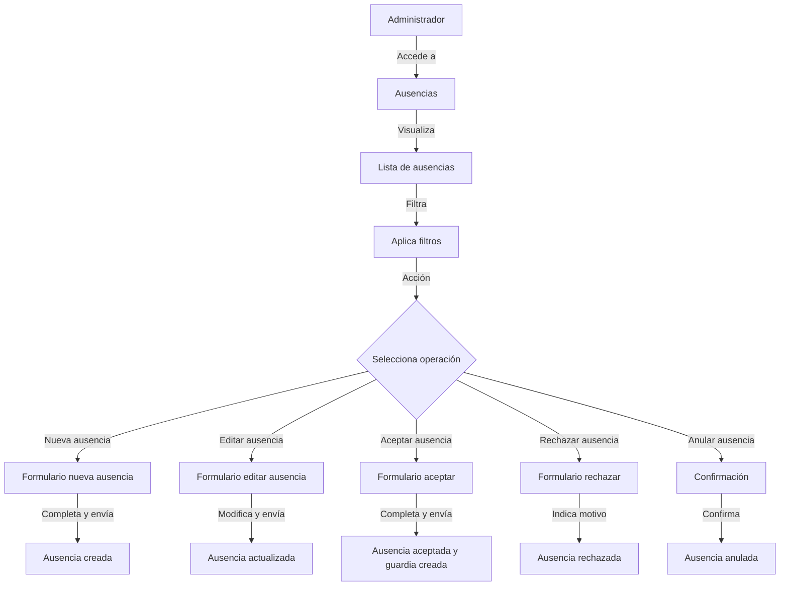
```mermaid
flowchart TD
    A[Administrador] -->|Accede a| B[Ausencias]
    B -->|Visualiza| C[Lista de ausencias]
    C -->|Filtra| D[Aplica filtros]
    D -->|Acción| E{Selecciona operación}
    E -->|Nueva ausencia| F[Formulario nueva ausencia]
    E -->|Editar ausencia| G[Formulario editar ausencia]
    E -->|Aceptar ausencia| H[Formulario aceptar]
    E -->|Rechazar ausencia| I[Formulario rechazar]
    E -->|Anular ausencia| J[Confirmación]
    F -->|Completa y envía| K[Ausencia creada]
    G -->|Modifica y envía| L[Ausencia actualizada]
    H -->|Completa y envía| M[Ausencia aceptada y guardia creada]
    I -->|Indica motivo| N[Ausencia rechazada]
    J -->|Confirma| O[Ausencia anulada]
```

## Flujos de Procesos Automáticos

### Creación de Guardia desde Ausencia

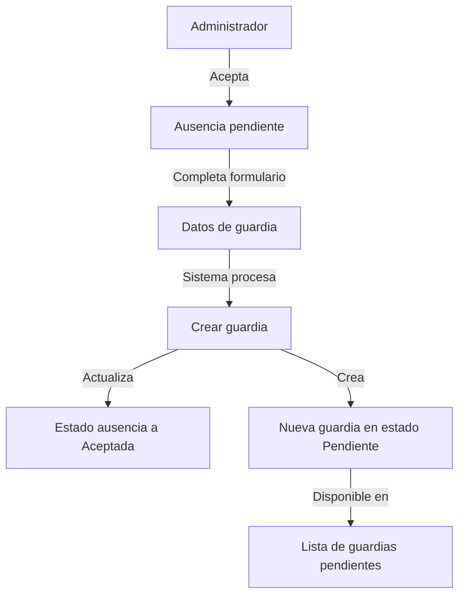
```mermaid
flowchart TD
    A[Administrador] -->|Acepta| B[Ausencia pendiente]
    B -->|Completa formulario| C[Datos de guardia]
    C -->|Sistema procesa| D[Crear guardia]
    D -->|Actualiza| E[Estado ausencia a Aceptada]
    D -->|Crea| F[Nueva guardia en estado Pendiente]
    F -->|Disponible en| G[Lista de guardias pendientes]
```

### Anulación de Guardia

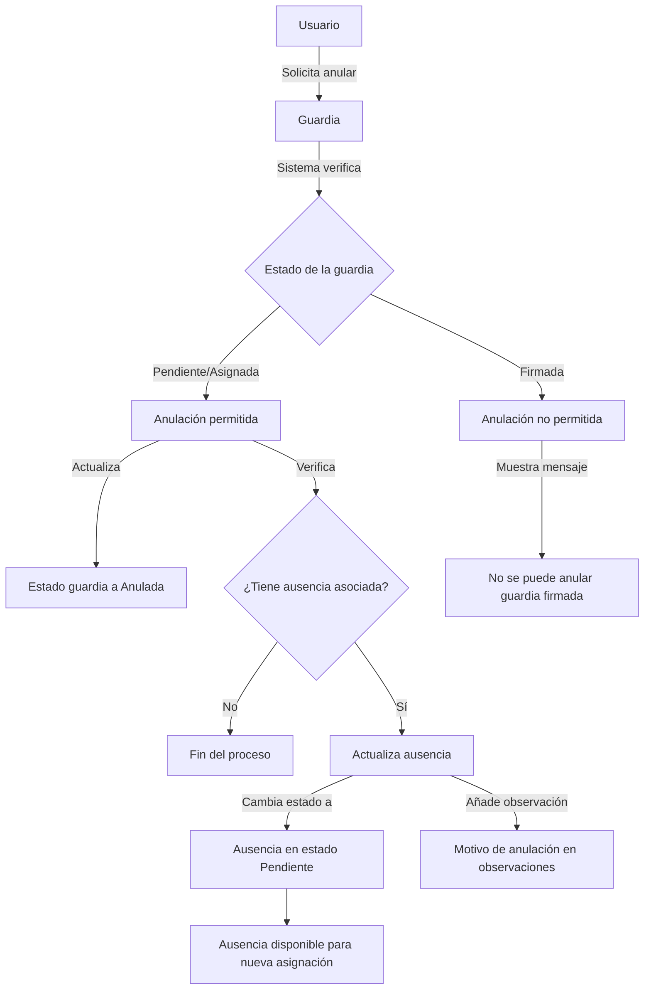
```mermaid
flowchart TD
    A[Usuario] -->|Solicita anular| B[Guardia]
    B -->|Sistema verifica| C{Estado de la guardia}
    C -->|Pendiente/Asignada| D[Anulación permitida]
    C -->|Firmada| E[Anulación no permitida]
    D -->|Actualiza| F[Estado guardia a Anulada]
    D -->|Verifica| G{¿Tiene ausencia asociada?}
    G -->|No| H[Fin del proceso]
    G -->|Sí| I[Actualiza ausencia]
    I -->|Cambia estado a| J[Ausencia en estado Pendiente]
    I -->|Añade observación| K[Motivo de anulación en observaciones]
    J --> L[Ausencia disponible para nueva asignación]
    E -->|Muestra mensaje| M[No se puede anular guardia firmada]
```

### Ciclo de Vida de una Ausencia

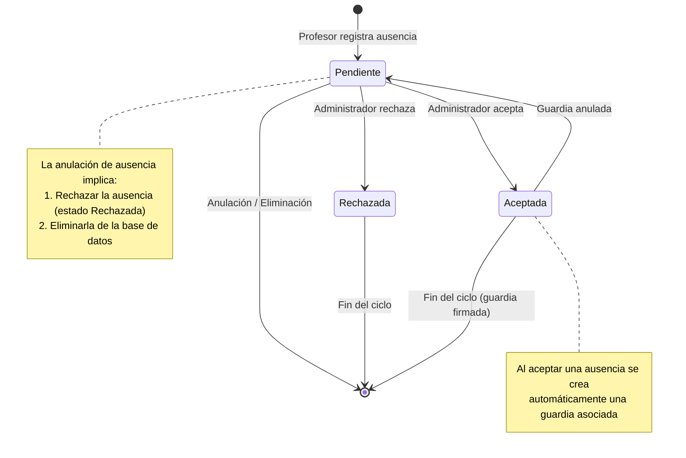
```mermaid
stateDiagram-v2
    [*] --> Pendiente: Profesor registra ausencia
    Pendiente --> Aceptada: Administrador acepta
    Pendiente --> Rechazada: Administrador rechaza
    Aceptada --> Pendiente: Guardia anulada
    Pendiente --> [*]: Anulación / Eliminación
    Rechazada --> [*]: Fin del ciclo
    Aceptada --> [*]: Fin del ciclo (guardia firmada)
    
    note right of Pendiente
      La anulación de ausencia implica:
      1. Rechazar la ausencia (estado Rechazada)
      2. Eliminarla de la base de datos
    end note
    
    note right of Aceptada
      Al aceptar una ausencia se crea
      automáticamente una guardia asociada
    end note
```

### Ciclo de Vida de una Guardia

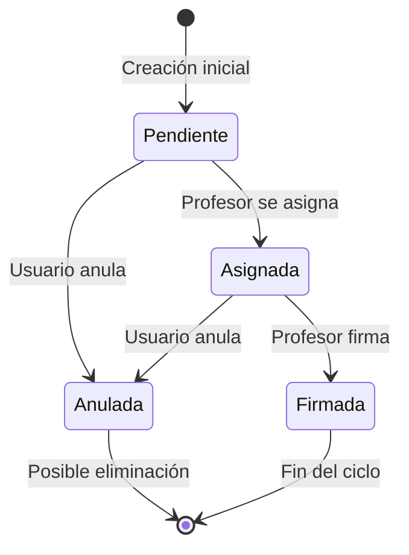
```mermaid
stateDiagram-v2
    [*] --> Pendiente: Creación inicial
    Pendiente --> Asignada: Profesor se asigna
    Asignada --> Firmada: Profesor firma
    Pendiente --> Anulada: Usuario anula
    Asignada --> Anulada: Usuario anula
    Anulada --> [*]: Posible eliminación
    Firmada --> [*]: Fin del ciclo
```

### Flujo de Creación y Gestión de Guardias

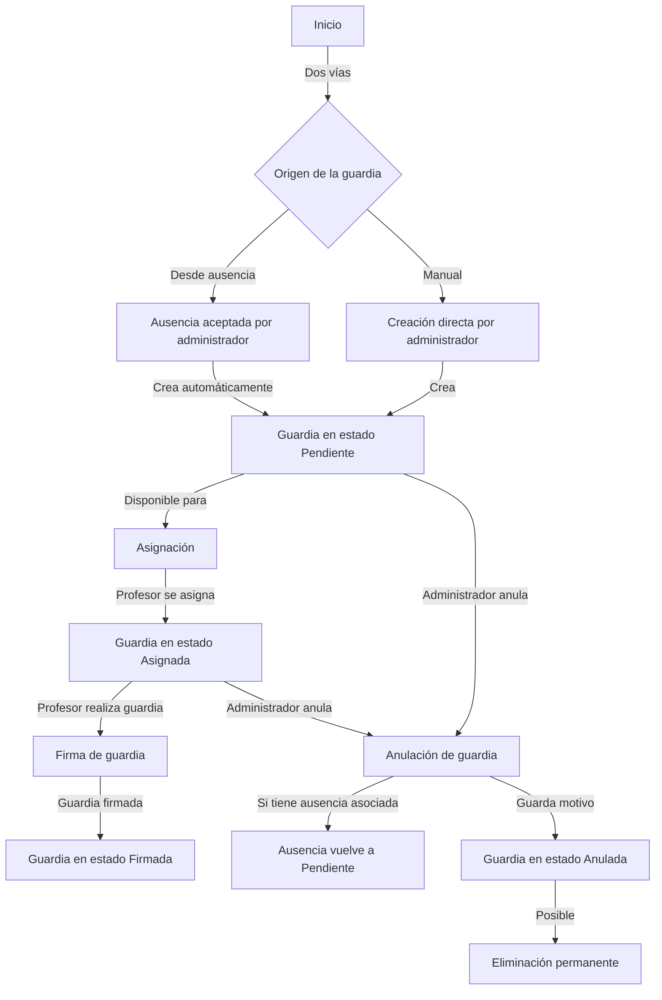
```mermaid
flowchart TD
    A[Inicio] -->|Dos vías| B{Origen de la guardia}
    B -->|Desde ausencia| C[Ausencia aceptada por administrador]
    B -->|Manual| D[Creación directa por administrador]
    C -->|Crea automáticamente| E[Guardia en estado Pendiente]
    D -->|Crea| E
    E -->|Disponible para| F[Asignación]
    F -->|Profesor se asigna| G[Guardia en estado Asignada]
    G -->|Profesor realiza guardia| H[Firma de guardia]
    H -->|Guardia firmada| I[Guardia en estado Firmada]
    E -->|Administrador anula| J[Anulación de guardia]
    G -->|Administrador anula| J
    J -->|Si tiene ausencia asociada| K[Ausencia vuelve a Pendiente]
    J -->|Guarda motivo| L[Guardia en estado Anulada]
    L -->|Posible| M[Eliminación permanente]
```

## Flujos de Integración entre Entidades

### Relación entre Ausencias y Guardias

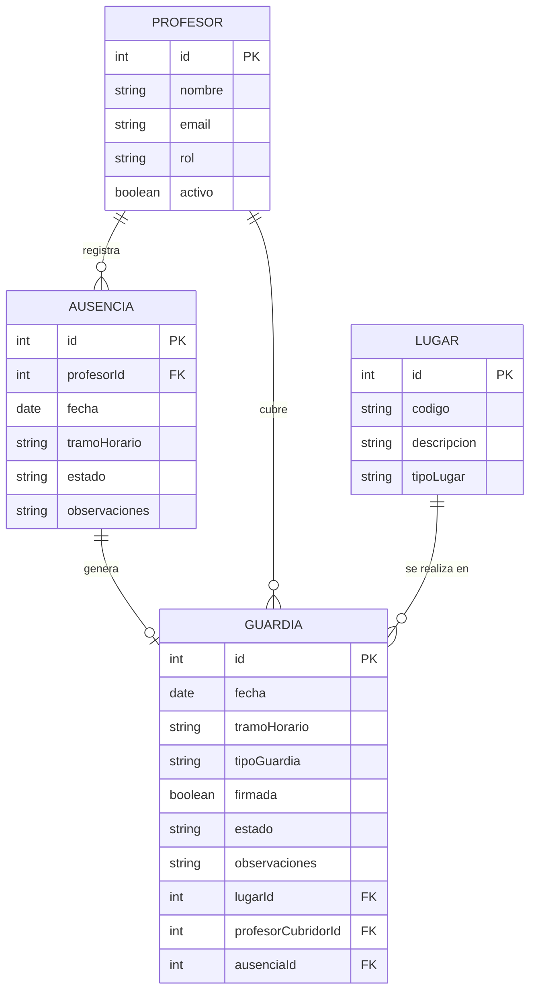
```mermaid
erDiagram
    AUSENCIA ||--o| GUARDIA : "genera"
    PROFESOR ||--o{ AUSENCIA : "registra"
    PROFESOR ||--o{ GUARDIA : "cubre"
    LUGAR ||--o{ GUARDIA : "se realiza en"
    
    AUSENCIA {
        int id PK
        int profesorId FK
        date fecha
        string tramoHorario
        string estado
        string observaciones
    }
    
    GUARDIA {
        int id PK
        date fecha
        string tramoHorario
        string tipoGuardia
        boolean firmada
        string estado
        string observaciones
        int lugarId FK
        int profesorCubridorId FK
        int ausenciaId FK
    }
    
    PROFESOR {
        int id PK
        string nombre
        string email
        string rol
        boolean activo
    }
    
    LUGAR {
        int id PK
        string codigo
        string descripcion
        string tipoLugar
    }
```

### Proceso Completo de Gestión de Ausencias y Guardias

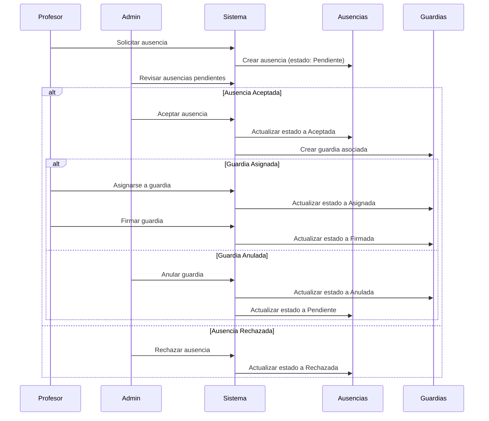
```mermaid
sequenceDiagram
    participant Profesor
    participant Admin
    participant Sistema
    participant Ausencias
    participant Guardias
    
    Profesor->>Sistema: Solicitar ausencia
    Sistema->>Ausencias: Crear ausencia (estado: Pendiente)
    Admin->>Sistema: Revisar ausencias pendientes
    
    alt Ausencia Aceptada
        Admin->>Sistema: Aceptar ausencia
        Sistema->>Ausencias: Actualizar estado a Aceptada
        Sistema->>Guardias: Crear guardia asociada
        
        alt Guardia Asignada
            Profesor->>Sistema: Asignarse a guardia
            Sistema->>Guardias: Actualizar estado a Asignada
            Profesor->>Sistema: Firmar guardia
            Sistema->>Guardias: Actualizar estado a Firmada
        else Guardia Anulada
            Admin->>Sistema: Anular guardia
            Sistema->>Guardias: Actualizar estado a Anulada
            Sistema->>Ausencias: Actualizar estado a Pendiente
        end
    else Ausencia Rechazada
        Admin->>Sistema: Rechazar ausencia
        Sistema->>Ausencias: Actualizar estado a Rechazada
    end
```

### Proceso de Creación de Guardias

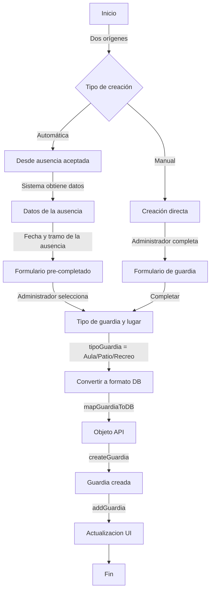
```mermaid
flowchart TD
    A[Inicio] -->|Dos orígenes| B{Tipo de creación}
    
    B -->|Automática| C[Desde ausencia aceptada]
    B -->|Manual| D[Creación directa]
    
    C -->|Sistema obtiene datos| E[Datos de la ausencia]
    E -->|Fecha y tramo de la ausencia| F[Formulario pre-completado]
    
    D -->|Administrador completa| G[Formulario de guardia]
    
    F -->|Administrador selecciona| H[Tipo de guardia y lugar]
    G -->|Completar| H
    
    H -->|"tipoGuardia = Aula/Patio/Recreo"| I[Convertir a formato DB]
    I -->|mapGuardiaToDB| J[Objeto API]
    J -->|createGuardia| K[Guardia creada]
    
    K -->|addGuardia| L[Actualizacion UI]
    L --> M[Fin]
```

### Proceso de Firma de Guardias con Tareas

```mermaid
sequenceDiagram
    participant Profesor
    participant UI
    participant GuardiasContext
    participant TareasGuardiaContext
    participant GuardiasService
    participant TareasService
    participant DB
    
    Profesor->>UI: Accede a "Firmar Guardia"
    UI->>GuardiasContext: getGuardiasAsignadas()
    GuardiasContext->>UI: Lista de guardias asignadas
    Profesor->>UI: Selecciona guardia
    Profesor->>UI: Clic en "Firmar"
    
    UI->>Profesor: Muestra formulario de firma
    alt Con tareas
        Profesor->>UI: Añade descripción de tareas realizadas
        UI->>TareasGuardiaContext: addTareaGuardia(guardiaId, descripcion)
        TareasGuardiaContext->>TareasService: createTareaGuardia()
        TareasService->>DB: INSERT INTO Tareas_guardia
    end
    
    Profesor->>UI: Añade observaciones (opcional)
    Profesor->>UI: Confirma firma
    
    UI->>GuardiasContext: firmarGuardia(guardiaId, observaciones)
    GuardiasContext->>GuardiasService: updateGuardia(guardiaId, {firmada: true, estado: "Firmada"})
    GuardiasService->>DB: UPDATE Guardias SET firmada = true, estado = 'Firmada'
    
    GuardiasContext->>UI: Actualización completada
    UI->>Profesor: Confirmación de firma exitosa
    
    note over Profesor,DB
      Una vez firmada, la guardia no puede ser anulada
      ni modificada en sus campos principales
    end note
```

### Proceso de Anulación de Guardias

```mermaid
sequenceDiagram
    participant Usuario
    participant UI
    participant GuardiasContext
    participant AusenciasContext
    participant AusenciasService
    participant GuardiasService
    participant DB
    
    Usuario->>UI: Solicitar anulación de guardia
    UI->>Usuario: Solicitar motivo de anulación
    Usuario->>UI: Proporcionar motivo
    UI->>GuardiasContext: anularGuardia(guardiaId, motivo)
    
    GuardiasContext->>GuardiasContext: Buscar guardia por ID
    
    alt Guardia Firmada
        GuardiasContext->>UI: Rechazar anulación (No permitido)
        UI->>Usuario: Mostrar mensaje de error
    else Guardia Pendiente/Asignada
        GuardiasContext->>GuardiasContext: Verificar si tiene ausencia asociada
        
        alt Con ausencia asociada
            GuardiasContext->>AusenciasContext: Obtener ausencia
            GuardiasContext->>AusenciasService: updateAusencia(ausenciaId, {
              estado: "Pendiente", 
              observaciones: `Original: ${observacionesOriginales}. Guardia anulada: ${motivo}`
            })
            AusenciasService->>DB: UPDATE Ausencias SET estado = 'Pendiente', observaciones = '...'
            GuardiasContext->>GuardiasService: updateGuardia(guardiaId, {
              estado: "Anulada", 
              ausenciaId: undefined,
              observaciones: `${observacionesOriginales} | ANULADA: ${motivo}`
            })
            GuardiasService->>DB: UPDATE Guardias SET estado = 'Anulada', ausencia_id = NULL, observaciones = '...'
        else Sin ausencia asociada
            GuardiasContext->>GuardiasService: updateGuardia(guardiaId, {
              estado: "Anulada", 
              observaciones: `${observacionesOriginales} | ANULADA: ${motivo}`
            })
            GuardiasService->>DB: UPDATE Guardias SET estado = 'Anulada', observaciones = '...'
        end
        
        GuardiasContext->>GuardiasContext: refreshGuardias()
        GuardiasContext->>AusenciasContext: refreshAusencias() (si hay ausencia asociada)
        GuardiasContext->>UI: Actualización completada
        UI->>Usuario: Mostrar confirmación de anulación
    end
    
    note over GuardiasContext,DB
      Las observaciones se actualizan preservando
      el contenido original y añadiendo el motivo
      de anulación para mantener un historial completo
    end note
```

## Ciclos de Vida

### Ciclo de Vida de una Ausencia

```mermaid
stateDiagram-v2
    [*] --> Pendiente: Profesor registra ausencia
    Pendiente --> Aceptada: Administrador acepta
    Pendiente --> Rechazada: Administrador rechaza
    Aceptada --> Pendiente: Guardia anulada
    Pendiente --> [*]: Anulación / Eliminación
    Rechazada --> [*]: Fin del ciclo
    Aceptada --> [*]: Fin del ciclo (guardia firmada)
    
    note right of Pendiente
      La anulación de ausencia implica:
      1. Rechazar la ausencia (estado Rechazada)
      2. Eliminarla de la base de datos
    end note
    
    note right of Aceptada
      Al aceptar una ausencia se crea
      automáticamente una guardia asociada
    end note
```

### Ciclo de Vida de una Guardia

```mermaid
stateDiagram-v2
    [*] --> Pendiente: Creación inicial
    Pendiente --> Asignada: Profesor se asigna
    Asignada --> Firmada: Profesor firma
    Pendiente --> Anulada: Usuario anula
    Asignada --> Anulada: Usuario anula
    Anulada --> [*]: Posible eliminación
    Firmada --> [*]: Fin del ciclo
``` 