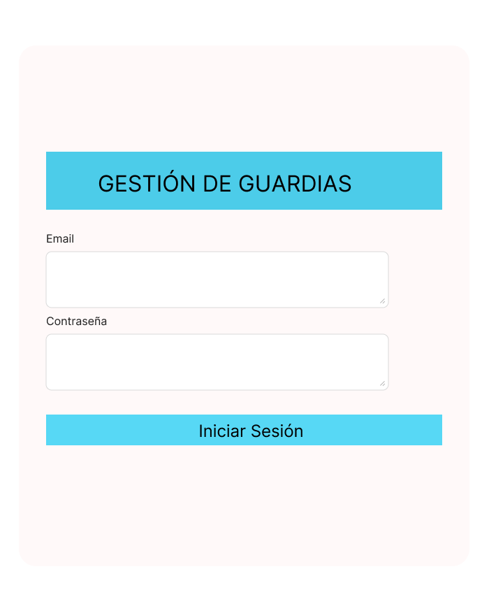
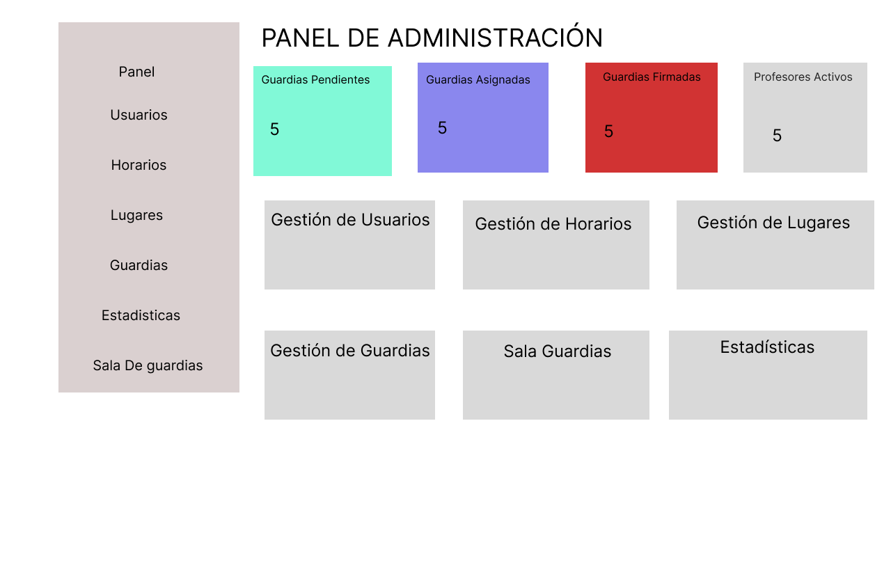
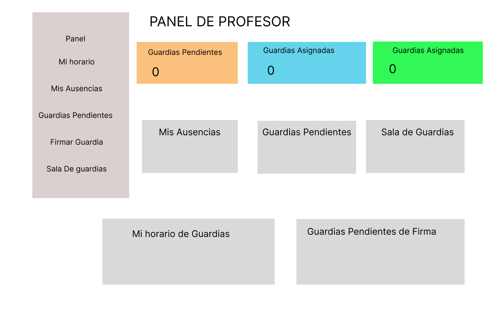
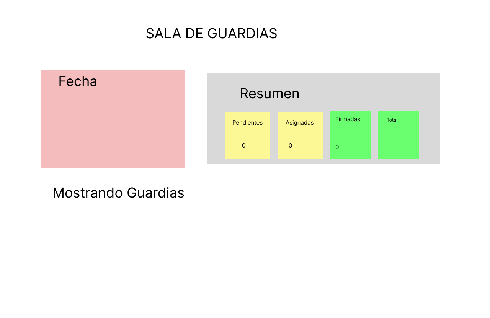
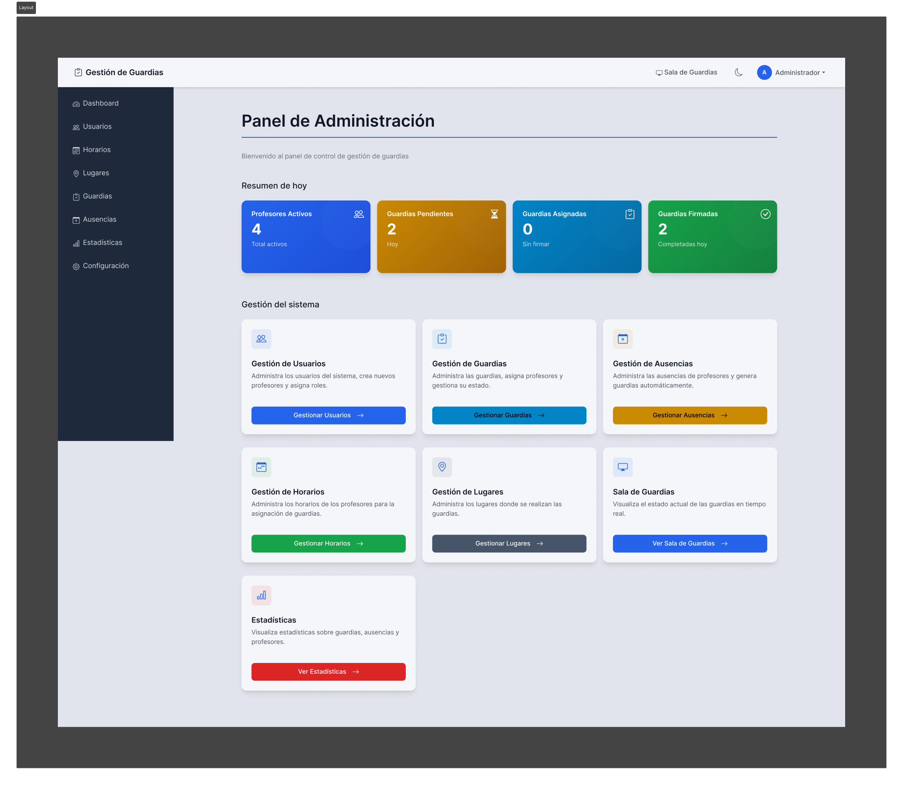
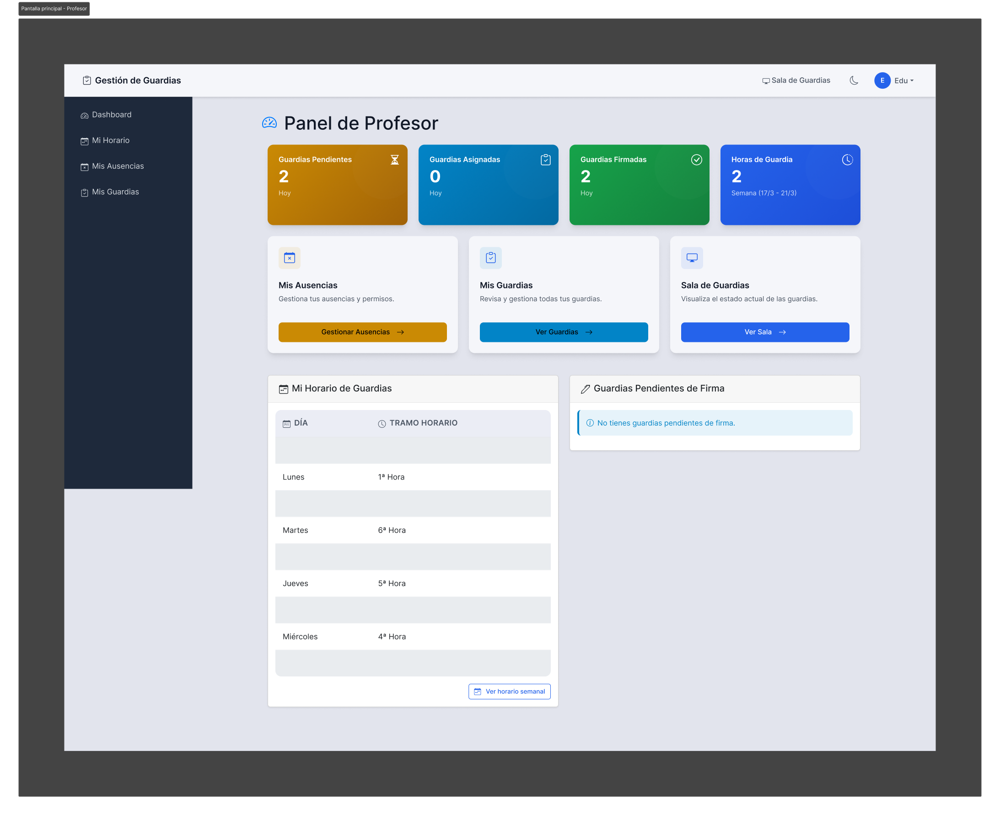
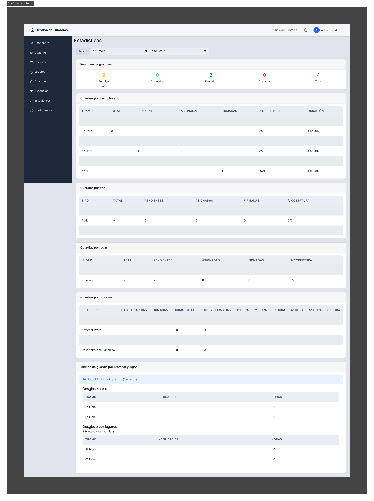
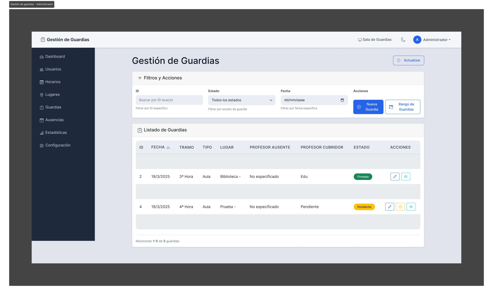
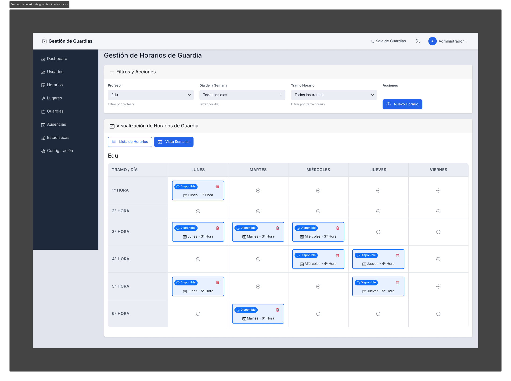
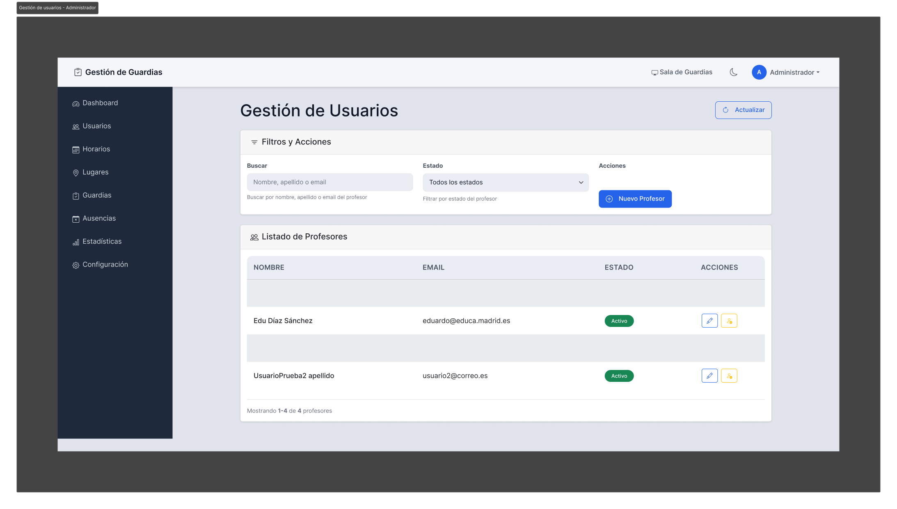

# Diseño de Interfaz de Usuario

Este documento presenta la evolución del diseño de la interfaz de usuario para la aplicación de Gestión de Guardias, mostrando tanto los prototipos iniciales como el resultado final implementado.

## Tabla de Contenidos

1. [Prototipos Iniciales](#prototipos-iniciales)
2. [Diseño Final Implementado](#diseño-final-implementado)
3. [Archivos de Diseño en Figma](#archivos-de-diseño-en-figma)

## Prototipos Iniciales

Los primeros diseños conceptuales sirvieron como base para establecer la estructura y el flujo de la aplicación.

### Pantalla de Inicio de Sesión

  

Diseño inicial minimalista de la pantalla de login, con campos para email y contraseña.

### Pantalla Principal del Administrador

  

Esquema conceptual del dashboard para administradores, mostrando las principales funcionalidades disponibles.

### Pantalla Principal del Profesor

  

Diseño inicial del dashboard para profesores, con acceso a sus guardias y ausencias.

### Sala de Guardias

  

Prototipo de la vista de sala de guardias, mostrando la información básica necesaria.

## Diseño Final Implementado

A partir de los prototipos, se desarrolló una interfaz final más elaborada y funcional, implementada con React, Bootstrap y técnicas modernas de CSS.

### Pantalla de Inicio de Sesión

  

Versión final de la pantalla de login, con una estética profesional y adaptada al sistema de diseño.

### Pantalla Principal del Administrador

  

Dashboard del administrador con tarjetas de resumen y accesos directos a todas las funcionalidades de gestión.

### Pantalla Principal del Profesor

  

Dashboard del profesor con vista rápida de sus guardias pendientes, horario y opciones de gestión personal.

### Sala de Guardias

  

Implementación completa de la sala de guardias, mostrando el estado actual de todas las guardias organizadas por tramo horario, con indicadores visuales de estado y profesores disponibles.

### Estadísticas del Administrador

  

Panel de estadísticas para el administrador, con gráficos y datos relevantes sobre guardias y profesores.

### Gestión de Guardias

  

Interfaz para la gestión de guardias, permitiendo filtrar, crear y modificar guardias existentes.

### Gestión de Horarios de Guardia

  

Panel para administrar los horarios de disponibilidad de los profesores, con vista semanal y opciones de edición.

### Gestión de Usuarios

  

Interfaz para la administración de usuarios, permitiendo crear, editar y gestionar profesores y administradores.

## Archivos de Diseño en Figma

En el directorio `doc/diseño_interfaz/figma` se encuentran los archivos originales de Figma:

- **PROTOTIPO DE LA APLICACIÓN.fig**: Contiene los diseños iniciales que sirvieron como base conceptual.
- **Gestión de guardias - Interfaz final - React.fig**: Presenta el diseño final que se implementó en la aplicación.

Estos archivos pueden abrirse con Figma (aplicación o versión web) para examinar en detalle los componentes, estilos y estructuras utilizadas en el diseño.

## Características Principales del Diseño

### Sistema de Diseño Consistente

- Paleta de colores coherente para estados (pendiente, asignada, firmada)
- Tipografía y espaciado uniforme
- Componentes reutilizables (tarjetas, botones, tablas)
- Soporte completo para modo oscuro

### Diseño Responsivo

Todas las pantallas están optimizadas para:
- Escritorio (pantallas grandes)
- Tablets (tamaño medio)
- Dispositivos móviles (pantallas pequeñas)

### Accesibilidad

- Alto contraste entre textos y fondos
- Tamaños de fuente legibles
- Iconos descriptivos con texto alternativo
- Estructura jerárquica clara

### Experiencia de Usuario

- Navegación intuitiva
- Retroalimentación visual para acciones
- Mensajes de confirmación y error
- Filtros y búsquedas para facilitar el acceso a la información 