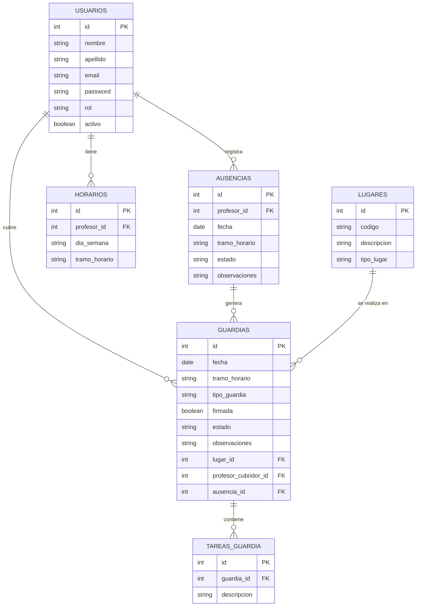
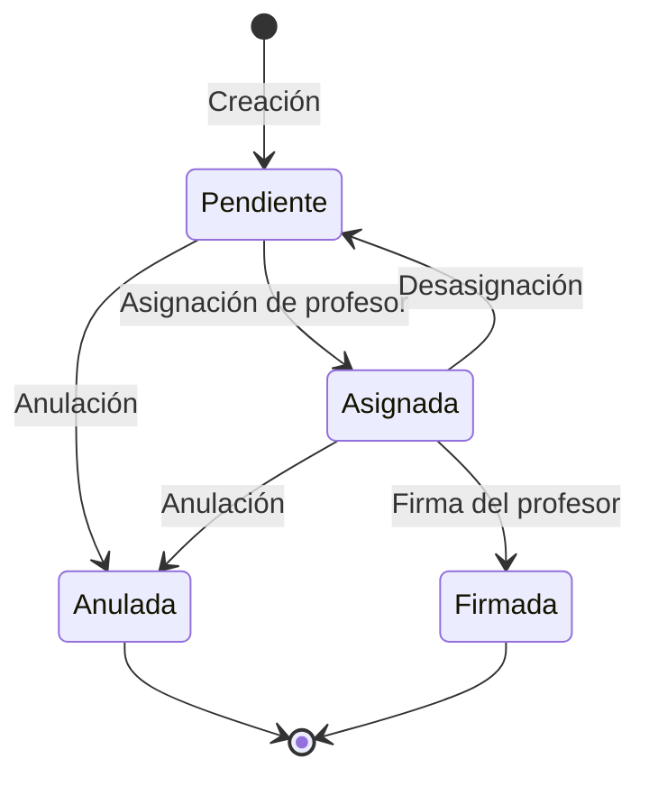
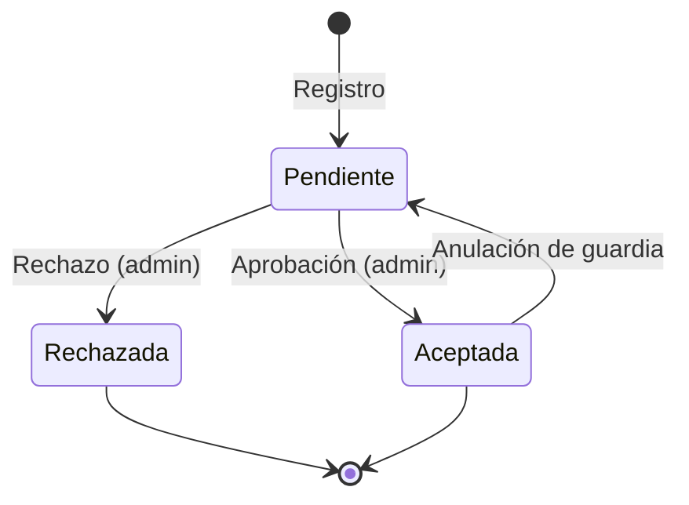
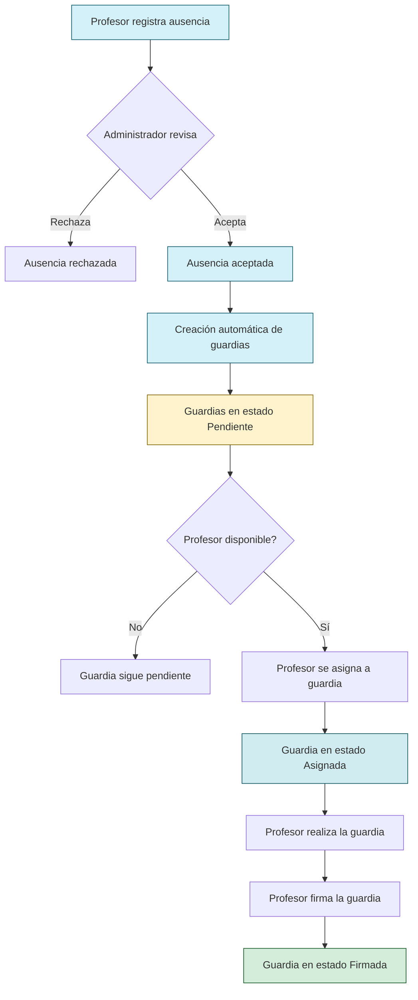
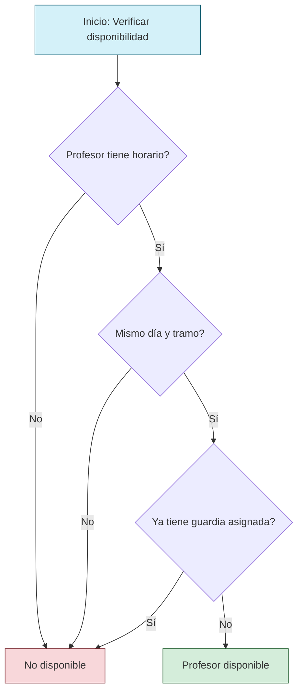
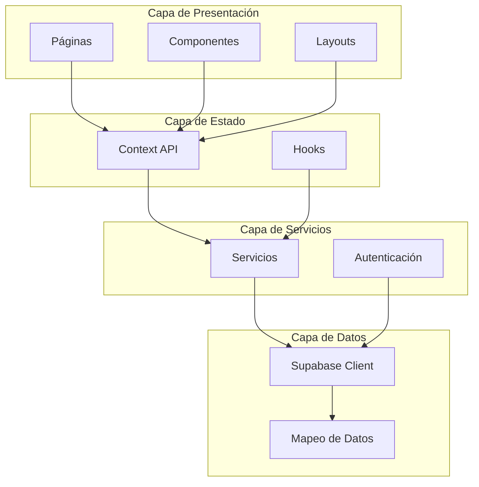

# Memoria del Proyecto: Sistema de Gestión de Guardias

## Índice

1. [Introducción](#introducción)
2. [Objetivos](#objetivos)
3. [Metodología](#metodología)
4. [Análisis y Diseño](#análisis-y-diseño)
   - [Requisitos Funcionales](#requisitos-funcionales)
   - [Requisitos No Funcionales](#requisitos-no-funcionales)
   - [Diagrama Entidad-Relación](#diagrama-entidad-relación)
   - [Diagramas de Estado](#diagramas-de-estado)
   - [Diagramas de Flujo](#diagramas-de-flujo)
5. [Tecnologías Utilizadas](#tecnologías-utilizadas)
6. [Arquitectura del Sistema](#arquitectura-del-sistema)
   - [Patrones de Diseño](#patrones-de-diseño)
   - [Estructura del Proyecto](#estructura-del-proyecto)
7. [Implementación](#implementación)
   - [Frontend](#frontend)
   - [Backend](#backend)
   - [Base de Datos](#base-de-datos)
   - [Seguridad](#seguridad)
8. [Funcionalidades Implementadas](#funcionalidades-implementadas)
9. [Interfaz de Usuario](#interfaz-de-usuario)
10. [Despliegue](#despliegue)
11. [Conclusiones](#conclusiones)
12. [Trabajo Futuro](#trabajo-futuro)
13. [Referencias](#referencias)

## Introducción

El Sistema de Gestión de Guardias es una aplicación web diseñada para facilitar la administración de guardias en centros educativos. Permite gestionar las ausencias del profesorado, asignar guardias de manera eficiente y realizar un seguimiento detallado de las mismas.

La gestión de guardias es un proceso crítico en los centros educativos que tradicionalmente se ha realizado de forma manual o con herramientas no específicas, lo que genera ineficiencias y dificultades en el control. Este sistema proporciona una solución integral que optimiza todo el flujo de trabajo, desde la notificación de ausencias hasta la firma de guardias completadas.

## Objetivos

Los objetivos principales del proyecto son:

1. Digitalizar y optimizar el proceso de gestión de guardias en centros educativos
2. Proporcionar una interfaz intuitiva para la gestión de ausencias y guardias
3. Automatizar la asignación de profesores a guardias según su disponibilidad
4. Facilitar el seguimiento y control de guardias realizadas
5. Ofrecer visualizaciones claras del estado actual de las guardias
6. Implementar un sistema seguro con control de acceso basado en roles
7. Desarrollar una aplicación responsive que funcione en múltiples dispositivos

## Metodología

Para el desarrollo del proyecto se ha seguido una metodología ágil basada en Scrum, adaptada a las necesidades específicas del proyecto. El proceso ha incluido:

1. **Análisis inicial**: Identificación de requisitos y definición del alcance
2. **Diseño**: Elaboración de diagramas, mockups y arquitectura del sistema
3. **Implementación**: Desarrollo incremental por sprints
4. **Pruebas**: Verificación de funcionalidades y corrección de errores
5. **Refactorización**: Mejora continua del código y optimización
6. **Documentación**: Elaboración de documentación técnica y de usuario

## Análisis y Diseño

### Requisitos Funcionales

1. **Gestión de usuarios**
   - Registro y administración de usuarios (profesores y administradores)
   - Control de acceso basado en roles
   - Activación/desactivación de usuarios

2. **Gestión de ausencias**
   - Registro de ausencias por parte de profesores
   - Aprobación/rechazo de ausencias por administradores
   - Visualización de historial de ausencias

3. **Gestión de guardias**
   - Creación automática de guardias a partir de ausencias aprobadas
   - Asignación de profesores a guardias
   - Firma de guardias realizadas
   - Anulación de guardias con actualización de estado

4. **Gestión de horarios**
   - Definición de disponibilidad por día y tramo horario
   - Visualización de horarios semanales
   - Prevención de conflictos y duplicados

5. **Visualización y reporting**
   - Sala de guardias con estado en tiempo real
   - Filtrado por fecha, tramo y estado
   - Estadísticas de guardias y ausencias

### Requisitos No Funcionales

1. **Usabilidad**
   - Interfaz intuitiva y fácil de usar
   - Diseño responsive para diferentes dispositivos
   - Feedback visual claro para todas las acciones

2. **Rendimiento**
   - Tiempos de respuesta inferiores a 2 segundos
   - Optimización para minimizar la carga del servidor
   - Eficiencia en consultas a la base de datos

3. **Seguridad**
   - Autenticación segura con contraseñas hasheadas
   - Autorización basada en roles
   - Protección de datos sensibles

4. **Escalabilidad**
   - Arquitectura que permita crecimiento futuro
   - Código modular y mantenible
   - Configuración centralizada para facilitar cambios

5. **Disponibilidad**
   - Funcionamiento 24/7 con mínimo tiempo de inactividad
   - Manejo adecuado de errores
   - Recuperación ante fallos

### Diagrama Entidad-Relación

El siguiente diagrama muestra las entidades principales del sistema y sus relaciones:



### Diagramas de Estado

#### Estado de las Guardias

El siguiente diagrama muestra los posibles estados de una guardia y las transiciones entre ellos:



#### Estado de las Ausencias



### Diagramas de Flujo

#### Flujo de Creación y Gestión de Guardias



#### Flujo de Validación de Disponibilidad para Guardias



## Tecnologías Utilizadas

### Frontend
- **Next.js 15**: Framework de React que proporciona renderizado híbrido, enrutamiento basado en archivos y otras optimizaciones
- **TypeScript**: Lenguaje tipado que extiende JavaScript, proporcionando seguridad de tipos
- **React**: Biblioteca para la construcción de interfaces de usuario
- **Bootstrap**: Framework CSS para diseño responsive
- **Bootstrap Icons**: Biblioteca de iconos
- **React Hook Form**: Biblioteca para la gestión de formularios
- **Recharts**: Biblioteca para la creación de gráficos y visualizaciones
- **Radix UI**: Componentes primitivos accesibles para construir interfaces de usuario

### Backend
- **Supabase**: Plataforma Backend-as-a-Service que incluye:
  - Base de datos PostgreSQL
  - API REST autogenerada
  - Autenticación y autorización
  - Políticas de seguridad a nivel de fila (RLS)
- **bcrypt.js**: Biblioteca para hashear y verificar contraseñas
- **js-cookie**: Biblioteca para manejo de cookies

### Herramientas de Desarrollo
- **ESLint**: Linting de código
- **TypeScript**: Verificación de tipos
- **dotenv**: Gestión de variables de entorno
- **ts-node**: Ejecución de TypeScript sin compilación previa

## Arquitectura del Sistema

La aplicación sigue una arquitectura de capas que separa claramente las responsabilidades:



#### 1. Capa de Presentación (UI)
- **Componentes React**: Organizados en carpetas por funcionalidad y tipo
- **Páginas**: Implementadas bajo el directorio `/app` siguiendo la estructura de Next.js App Router
- **Layout**: Componentes reutilizables como Navbar, Sidebar y ProtectedLayout para estructura común

#### 2. Capa de Estado y Lógica de Negocio
- **Context API de React**: Implementación de proveedores de contexto para gestionar el estado global
- **Hooks personalizados**: Encapsulan lógica reutilizable
- **Validación**: Implementada en formularios y antes de operaciones CRUD

#### 3. Capa de Servicios
- **Servicios por entidad**: Cada entidad (usuarios, guardias, horarios, etc.) tiene su propio servicio
- **Autenticación**: Servicio específico para manejo de login/logout y verificación de credenciales

#### 4. Capa de Datos
- **Supabase Client**: Cliente para interactuar con la API de Supabase
- **Mapeo de datos**: Funciones para convertir entre formatos de base de datos y aplicación
- **Configuración centralizada**: Constantes y enumeraciones en `db-config.ts`

### Patrones de Diseño

1. **Patrón Repositorio**
   - Implementado mediante servicios (*Service.ts) que encapsulan operaciones CRUD
   - Abstracción de la capa de acceso a datos
   - Centralización de lógica de negocio relacionada con entidades

2. **Patrón Proveedor (Provider Pattern)**
   - Uso de Context API de React para proporcionar estado global. Implementado por los archivos `./src/*Context.tsx`:
   - Encapsulación de lógica relacionada con cada dominio
   - Inyección de dependencias a componentes

3. **Patrón Middleware**
   - Interceptores para autorización y redirección
   - Validación de sesiones activas
   - Control de acceso basado en roles
   - Implementado mediante el archivo `middleware.ts`

4. **Patrón Composición**
   - Componentes que se componen para crear interfaces complejas
   - Reutilización de funcionalidad
   - Separación de responsabilidades
   - Un ejemplo son aquellos componentes implementados a partir de `ProtectedLayout.tsx`

5. **Container/Presentational Pattern**
   - Separación entre lógica (containers) y presentación (componentes UI)
   - Mejora de la reutilización
   - Facilita el testing

### Estructura del Proyecto

```
gestion-guardias/
├── app/                       # Páginas (Next.js App Router)
│   ├── admin/                 # Sección de administrador
│   ├── profesor/              # Sección de profesor
│   ├── sala-guardias/         # Vista de sala de guardias
│   └── login/                 # Página de inicio de sesión
├── components/                # Componentes reutilizables
│   ├── common/                # Componentes compartidos
│   ├── layout/                # Layouts reutilizables
│   └── ui/                    # Componentes UI básicos
├── lib/                       # Servicios y utilidades
│   ├── *Service.ts            # Servicios para entidades
│   ├── supabaseClient.ts      # Cliente Supabase
│   └── db-config.ts           # Configuración centralizada
├── src/                       # Código fuente principal
│   ├── contexts/              # Contextos de React
│   ├── types/                 # Definiciones de tipos
│   └── App.css                # Estilos globales
├── scripts/                   # Scripts utilitarios
├── middleware.ts              # Middleware de protección
└── public/                    # Archivos estáticos
```

## Implementación

### Frontend

La interfaz de usuario se ha implementado siguiendo los principios de diseño responsive y usabilidad, con especial atención a la experiencia del usuario. Se ha utilizado Next.js con App Router para la organización de páginas y rutas.

Los componentes están organizados siguiendo una estructura lógica:
- Componentes comunes reutilizables
- Layouts para estructura compartida
- Componentes UI para elementos básicos de interfaz

El estado global se gestiona mediante Context API de React, con contextos específicos para cada dominio funcional:
- `AuthContext`: Autenticación y gestión de sesiones
- `GuardiasContext`: Estado y operaciones CRUD de guardias
- `AusenciasContext`: Estado y operaciones CRUD de ausencias
- `HorariosContext`: Estado y operaciones CRUD de horarios
- `UsuariosContext`: Estado y operaciones CRUD de usuarios
- `LugaresContext`: Estado y operaciones CRUD de lugares
- `ThemeContext`: Gestión del tema claro/oscuro

### Backend

El backend se implementa mediante Supabase, que proporciona:
- Base de datos PostgreSQL
- API REST autogenerada
- Autenticación y autorización
- Almacenamiento de archivos
- Funciones en tiempo real

La comunicación con Supabase se realiza a través de servicios específicos para cada entidad, que encapsulan la lógica de acceso a datos y proporcionan una interfaz clara para el frontend.

La autenticación se implementa mediante:
- Verificación de credenciales con bcrypt
- Almacenamiento seguro de sesiones en cookies y localStorage
- Middleware para protección de rutas

### Base de Datos

La base de datos PostgreSQL gestionada por Supabase sigue el esquema definido en el diagrama entidad-relación. Las tablas principales son:

1. **Usuarios**: Almacena información de profesores y administradores
2. **Ausencias**: Registro de ausencias de profesores
3. **Guardias**: Guardias generadas a partir de ausencias
4. **Horarios**: Disponibilidad de profesores por día y tramo
5. **Lugares**: Espacios donde se realizan las guardias
6. **Tareas_guardia**: Tareas asignadas durante ausencias

Se han implementado índices para optimizar las consultas más frecuentes:
- Índices por fecha para guardias y ausencias
- Índices por profesor para horarios y ausencias
- Índices por estado para filtrado rápido

La base de datos incluye triggers para mantener la integridad de los datos, como la actualización automática del estado de una guardia cuando se asigna un profesor.

### Seguridad

El sistema implementa varias capas de seguridad:

1. **Autenticación**:
   - Contraseñas hasheadas con bcrypt
   - Sesiones almacenadas en cookies y localStorage
   - Verificación cruzada para evitar manipulación

2. **Autorización**:
   - Control de acceso basado en roles
   - Middleware de protección de rutas
   - Redirección automática según rol

3. **Seguridad de datos**:
   - Validación de entradas
   - Políticas de seguridad a nivel de fila (RLS)
   - Protección contra inyección SQL

## Funcionalidades Implementadas

### Sistema de Autenticación
- Login mediante email y contraseña
- Verificación de credenciales con bcrypt
- Almacenamiento seguro de sesión
- Protección de rutas basada en roles
- Middleware para control de acceso

### Gestión de Usuarios
- CRUD completo de usuarios
- Activación/desactivación de usuarios
- Asignación de roles (admin/profesor)
- Visualización filtrada de usuarios

### Gestión de Guardias
- Creación automática a partir de ausencias
- Asignación de profesores a guardias pendientes
- Firma de guardias realizadas
- Visualización por fecha y tramo horario
- Filtros por estado, profesor, etc.
- Gestión de tareas para ausencias
- Anulación de guardias con actualización de estado

### Gestión de Ausencias
- Registro de ausencias por parte de profesores
- Aceptación/rechazo por parte de administradores
- Estados: Pendiente, Aceptada, Rechazada
- Generación automática de guardias al aceptar ausencias

### Gestión de Horarios
- Asignación de horarios de disponibilidad a profesores
- Vista semanal de horarios
- Verificación de disponibilidad para asignación de guardias
- Prevención de conflictos y duplicados

### Sala de Guardias
- Visualización en tiempo real del estado de las guardias
- Filtrado por fecha y tramo horario
- Vista detallada con información completa de cada guardia
- Identificación visual por colores según estado

### Modo Oscuro
- Implementación completa de temas claro y oscuro
- Persistencia de preferencia de tema
- Detección automática de preferencia del sistema

## Interfaz de Usuario

La interfaz de usuario se ha diseñado siguiendo principios de usabilidad y experiencia de usuario, con especial atención a:

1. **Claridad visual**: Uso de colores para indicar estados, iconos descriptivos y tipografía legible
2. **Coherencia**: Elementos de interfaz consistentes en toda la aplicación
3. **Feedback**: Notificaciones y mensajes de confirmación para acciones importantes
4. **Accesibilidad**: Etiquetas descriptivas, contraste adecuado y navegación por teclado
5. **Responsive**: Adaptación a diferentes tamaños de pantalla

El diseño visual ha evolucionado desde prototipos iniciales hasta la implementación final, siguiendo un proceso iterativo de mejora continua. Se ha puesto especial énfasis en la experiencia móvil, garantizando que todas las funcionalidades sean accesibles en dispositivos pequeños.

## Despliegue

La aplicación ha sido desplegada en la plataforma Render, con acceso público a través de la siguiente URL:

[https://gestion-guardias.onrender.com/](https://gestion-guardias.onrender.com/)

El archivo `render.yaml` proporciona configuración para despliegue automático en Render, facilitando la puesta en producción del sistema.

## Conclusiones

El Sistema de Gestión de Guardias representa una solución integral para la gestión de guardias en centros educativos, proporcionando herramientas eficientes para:

1. **Digitalización de procesos**: Eliminación de gestión manual y papeleos
2. **Optimización de recursos**: Asignación eficiente de profesores según disponibilidad
3. **Seguimiento detallado**: Control en tiempo real de guardias pendientes y realizadas
4. **Accesibilidad**: Interfaz adaptada a diferentes dispositivos
5. **Seguridad**: Protección de datos y acceso controlado

El sistema cumple con los objetivos planteados inicialmente, ofreciendo una solución robusta, escalable y fácil de usar para la gestión de guardias educativas.

### Fortalezas

1. **Arquitectura sólida**:
   - Clara separación de responsabilidades
   - Uso efectivo de patrones de diseño
   - Código modular y mantenible

2. **Experiencia de usuario**:
   - Interfaz intuitiva con flujos de trabajo claros
   - Feedback visual consistente
   - Diseño responsive para múltiples dispositivos
   - Modo oscuro bien implementado

3. **Seguridad robusta**:
   - Múltiples capas de protección
   - Autenticación segura
   - Autorización basada en roles

4. **Escalabilidad**:
   - Estructura que permite añadir nuevas funcionalidades
   - Componentes reutilizables
   - Configuración centralizada

## Trabajo Futuro

Como líneas de trabajo futuro, se proponen las siguientes mejoras y ampliaciones:

1. **Implementación de pruebas automatizadas**:
   - Pruebas unitarias con Jest y React Testing Library
   - Pruebas e2e con Cypress o Playwright
   - Integración continua mediante GitHub Actions

2. **Mejoras de rendimiento**:
   - Implementación de memoización para cálculos costosos
   - Virtualización de listas largas
   - Optimización de consultas a base de datos

3. **Ampliación de funcionalidades**:
   - Sistema de notificaciones (email, push)
   - Estadísticas avanzadas y reportes exportables
   - Integración con calendarios externos (Google Calendar, Outlook)
   - Aplicación móvil nativa con React Native

4. **Mejoras de UX/UI**:
   - Animaciones y transiciones
   - Tutoriales interactivos para nuevos usuarios
   - Personalización de interfaz por usuario

5. **Internacionalización**:
   - Soporte para múltiples idiomas
   - Adaptación a diferentes formatos de fecha y hora
   - Configuraciones regionales

## Referencias

1. Documentación oficial de Next.js: https://nextjs.org/docs
2. Documentación de Supabase: https://supabase.io/docs
3. React Documentation: https://reactjs.org/docs
4. Bootstrap Documentation: https://getbootstrap.com/docs
5. TypeScript Handbook: https://www.typescriptlang.org/docs
6. React Hook Form Documentation: https://react-hook-form.com/
7. Recharts Documentation: https://recharts.org/en-US/
8. Radix UI Documentation: https://www.radix-ui.com/docs/primitives/overview/introduction 